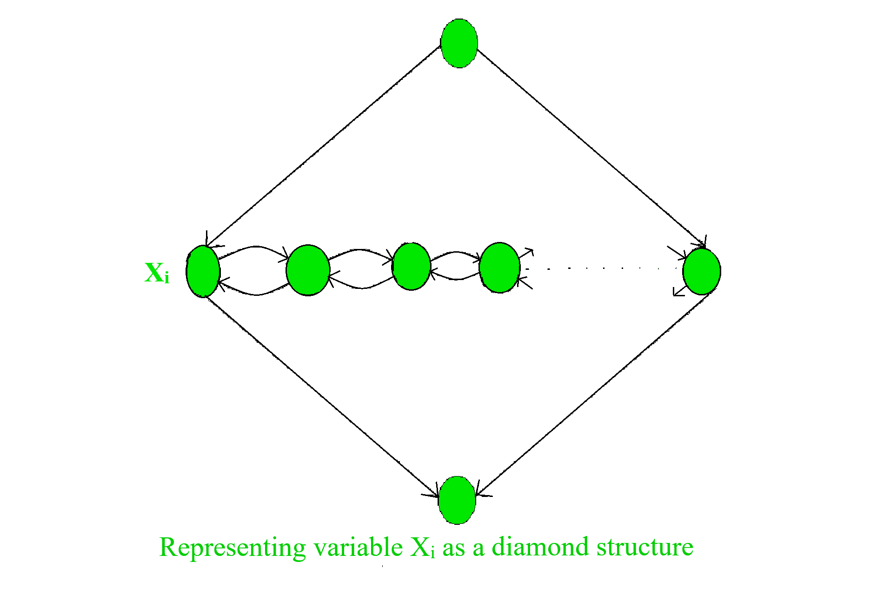
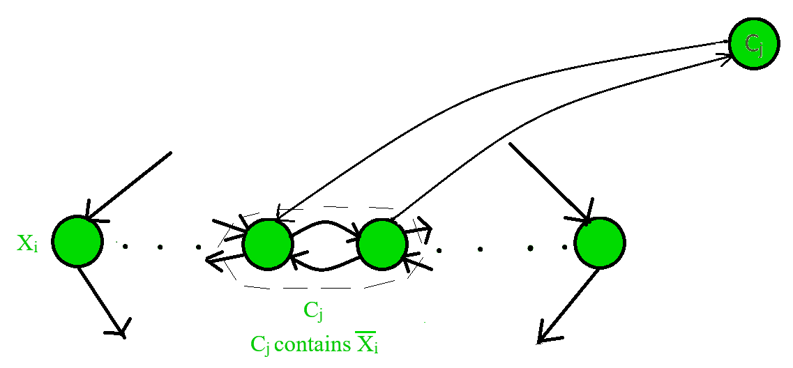

# 证明哈密顿路径是 NP 完全的

> 原文： [https://www.geeksforgeeks.org/proof-hamiltonian-path-np-complete/](https://www.geeksforgeeks.org/proof-hamiltonian-path-np-complete/)

先决条件： [NP 完整性](https://www.geeksforgeeks.org/np-completeness-set-1/)
可以成为*的成员的语言类别决定*迅速属于 **P** 的类别和 可以通过*验证成员资格*迅速属于 **NP** 的类别（*代表多项式时间*中非确定性图灵机解决的问题）。
简而言之，每个 NP 问题都有其自己的多项式时间验证器。 语言 A 的验证者是算法 V，其中

```
A = {w | V accepts (w, c) for some string c}
where c is certificate or proof that w is a member of A.

```

我们对 NP-完全问题感兴趣。 NP-Complete 问题定义如下：

```
(1)The problem itself is in NP class.
(2)All other problems in NP class can be polynomial time reducible to that.
(B is polynomial time reducible to C is denoted as )

```

如果仅满足第二条件，则该问题称为 NP-Hard。
但是不可能将每个 NP 问题都简化为另一个 NP 问题以始终显示其 NP 完整性。 这就是为什么如果我们想证明问题是 NP-Complete，我们只显示问题在 NP 中，并且任何 NP-Complete 问题都可归结为 NP，那么我们就完成了，即如果 B 是 NP-Complete 且 NP 中的 C，则 C 为 NP-Complete。
我们必须证明哈密顿路径是 NP-完全的。 有向图 G 中的**哈密顿路径**或 **HAMPATH** 是恰好通过每个节点一次的有向路径。 我们考虑测试有向图是否包含连接两个指定节点的哈密顿路径的问题。

```
*HAMPATH* = {(G, s, t) | G is directed graph with a Hamiltonian path from s to t}
```

为了证明 HAMPATH 是 NP-Complete，我们必须证明 HAMPATH 在 NP 中。 为了证明 HAMPATH 在 NP 中，我们必须有一个多项式时间验证器。 即使我们没有快速的多项式时间算法来确定图形是否包含 HAMPATH，如果以某种方式发现了这样的路径（可能是通过指数时间蛮力搜索），我们也可以轻松地算出该路径是否为 HAMPATH。 多项式时间内是否使用 HAMPATH。 在这里，证书将是 G 中从 s 到 t 本身的哈密顿路径。 因此 HAMPATH 在 NP 中得到了证明。
因此，现在我们必须证明 NP 类的每个问题都是 HAMPATH 可简化的多项式时间，以显示其 NP 完全性。 相反，我们将证明 3SAT（先前由 SAT 证明的 NP 完全问题（电路可满足性问题））可以多项式化为 HAMPATH。 我们将给定的 *cnf* （合取范式）形式转换为图形，其中小工具（模拟变量和子句的结构）将模拟变量和子句（与连接的几个文字或变量）。 现在我们必须证明
对于每个 3-cnf 公式，我们将展示如何使用 s 和 t 建立图 G，其中 s 和 t iff 之间存在哈密顿路径是可满足的。
我们从包含 k 个子句的 3-cnf 公式开始，

其中每个是文字或。 假设为的 *l* 变量。现在我们展示如何将转换为图 G。我们构造的图 G 有不同的部分来表示变量和出现的子句 在中。
我们用菱形结构表示每个变量，该结构包含水平的节点行，如下图所示。 我们指定稍后出现在水平行中的节点数。

下图描述了 G 的全局结构。它显示了 G 的所有元素及其关系，除了表示变量与包含它们的子句之间关系的边。

每个菱形结构均包含一个水平的节点行，这些节点的水平边沿两个方向延伸。 水平行包含 2k 个节点（每个子句 2 个节点），以及子句的每两个节点之间的 k-1 个额外节点，以及菱形末端的 2 个节点； 总共 3k + 1 个节点。 下图给出了清晰的图片。

如果变量出现在子句中，我们将第 i 个 diamoond 中的第 j 个对中的以下两个边添加到第 j 个子句节点。

如果出现在子句 c_j 中，则将第 i 个菱形中的第 j 个对中的两个边添加到第 j 个子句节点，如下图所示。

在每个子句中添加与或的每次出现相对应的所有边之后，G 的构造就完成了。 为了证明其正确性，我们将证明是否可以满足，从 s 到 t 存在哈密顿路径，反之，如果存在，则可以满足。
假设是可满足的。 为了演示从 s 到 t 的哈密顿路径，我们首先忽略子句节点。 路径从 s 开始，依次经过每个菱形，并在 t 结束。 击中菱形的水平节点。 路径从左到右为曲折形，或从右到左为曲折形； 对的满意分配确定分别为分配了 TRUE 还是 FALSE。 我们在下图中显示这两种情况。

到目前为止，此路径涵盖 G 中除子句节点之外的所有节点。 我们可以通过在水平节点处添加弯路轻松地将它们包括在内。 在每个子句中，我们通过满足赋值来选择一个赋值为 TRUE 的文字。
如果我们在条款中选择了，则可以在第 i 颗钻石的第 j 对上绕行。 这样做是可行的，因为必须为 TRUE，所以路径之字形从左到右穿过相应的菱形。 因此，节点的边缘处于正确的顺序，以允许绕行并返回。
同样，如果我们在子句中选择了，则我们可以在第 i 颗钻石的第 j 对上绕行，因为必须为 FALSE，所以路径 zag-zigs 从右到左穿过相应的钻石 。 因此，节点的边缘再次处于正确的顺序，以允许绕行并返回。 如果每个字面量 in 子句都提供绕行选项，则每次绕行一次。 因此，每个节点仅被访问一次，从而构造了哈密顿路径。
对于相反的方向，如果 G 具有从 s 到 t 的哈密顿路径，我们证明的分配令人满意。 如果哈密顿路径是正常的，即除闭合节点的 de 回路径外，它从上到下依次通过菱形； 我们可以轻松获得满意的任务。 如果菱形中的路径之字形，则将变量分配为 TRUE，如果其路径之字形，则将其分配为 FALSE。 因为每个节点都是通过观察绕道而出现在路径上的，所以我们可以确定相应的 TRUE 变量。
所有剩下的表明哈密顿路径必须是正常的表示该路径从一个菱形进入一个子句，但又回到另一个菱形，如下图所示。

路径从节点到 c； 但不是在同一钻石中返回，而是在其他钻石中返回。 如果发生这种情况，则或必须是分隔符节点。 如果是分隔符节点，则中唯一进入的边将来自或。 如果是分隔符节点，则和将在同一子句中，则从，和 c 进入的边。 无论哪种情况，路径都无法从输入，因为是指向的唯一可用节点，因此路径必须通过退出。 因此，哈密顿路径必须是正常的。 这种减少显然是在多项式时间内进行的，因此证明 HAMPATH 是 NP-完全的。

图片参考： [https://tr.m.wikipedia.org/wiki/Hamilton_yolu](https://tr.m.wikipedia.org/wiki/Hamilton_yolu)


* * *

* * *

如果您喜欢 GeeksforGeeks 并希望做出贡献，则还可以使用 [tribution.geeksforgeeks.org](https://contribute.geeksforgeeks.org/) 撰写文章，或将您的文章邮寄至 tribution@geeksforgeeks.org。 查看您的文章出现在 GeeksforGeeks 主页上，并帮助其他 Geeks。

如果您发现任何不正确的地方，请单击下面的“改进文章”按钮，以改进本文。