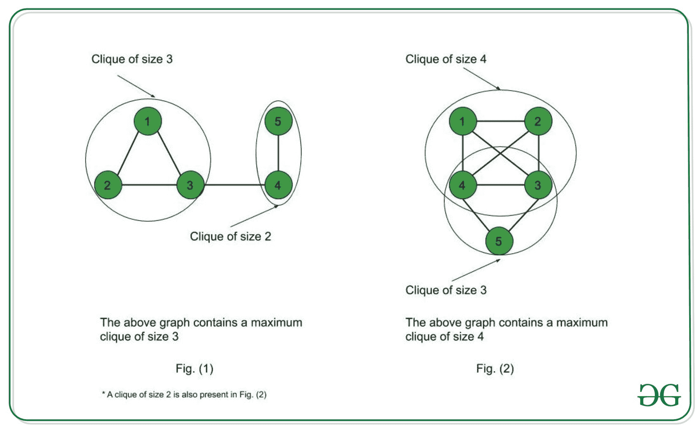

# 证明集团决策问题是 NP 完全

> 原文： [https://www.geeksforgeeks.org/proof-that-clique-decision-problem-is-np-complete/](https://www.geeksforgeeks.org/proof-that-clique-decision-problem-is-np-complete/)

**先决条件**：[NP 完整性](https://www.geeksforgeeks.org/np-completeness-set-1/)

集团是图的子图，因此该子图中的所有顶点都相互连接，即子图是完整图。 最大派系问题是找到给定图 G 的最大尺寸派系，该图是一个完整图，它是 G 的子图，并且包含最大顶点数。 这是一个优化问题。 相应地，集团决策问题是要确定给定图中是否存在大小为 k 的集团。

 

为了证明问题是 NP-完全的，我们必须证明它同时属于 NP 和 NP-Hard 类。 （由于 NP-完全问题是 NP-Hard 问题，也属于 NP）

**集团决策问题属于 NP** –如果问题属于 NP 类，则它应该具有多项式时间可验证性，即具有证书，我们应该能够在多项式时间内进行验证 解决问题的方法。

**证明**：

1.  <u>证书</u> –假设证书是由集团中的节点组成的集合 S，而 S 是 G 的子图。

2.  <u>验证</u> –我们必须检查图中是否存在大小为 k 的团。 因此，验证 S 中的节点数是否等于 k，需要 O（1）时间。 验证每个顶点的出度（k-1）是否为 O（k 2 ）时间。 （由于在完整图中，每个顶点都通过一条边连接到每个其他顶点。因此，完整图中的边总数= k C 2 = k *（k -1）/ 2）。 因此，要检查由 S 中的 k 个节点形成的图是否完整，需要花费 O（k 2 ）= O（n 2 ）时间（因为 k < = n，其中 n 是 G 中的顶点数）。

因此，集团决策问题具有多项式时间可验证性，因此属于 NP 类。

**集团决策问题属于 NP-Hard** –如果每个 NP 问题都可以在多项式时间内归纳为 L，则问题 L 属于 NP-Hard。 现在，让 C 提出“派系决策问题”。为了证明 C 是 NP-Hard 问题，我们采用一个已知的 NP-Hard 问题，即 S，并针对特定实例将其简化为 C。 如果这种减少可以在多项式时间内完成，那么 C 也是 NP-Hard 问题。 布尔可满足性问题（S）是由 [Cook 定理](https://en.wikipedia.org/wiki/Cook–Levin_theorem)证明的 NP-完全问题。 因此，可以在多项式时间内将 NP 中的每个问题简化为 S。 因此，如果在多项式时间内将 S 简化为 C，则可以将每个 NP 问题在多项式时间内简化为 C，从而证明 C 为 NP-Hard。

<u>证明布尔可满足性问题简化为集团决策问题</u>

证明布尔表达式为– F =（x 1 vx 2 ）^（x 1 'vx 2 '）^（x 1 vx 3 ）其中 x 1 ，x 2 ，x 3 是变量，“ ^”表示逻辑“和”，“ v”表示逻辑“或”，而 x'表示 x 的补数。 让每个括号内的表达式为一个子句。 因此，我们有三个子句– C 1 ，C 2 和 C 3 。 将顶点视为– < x 1 ，1 >； < x 2 ，1 >； < x 1 ’，2 >； < x 2 ’，2 >； < x 1 ，3 >； < x 3 3 >其中，每个顶点中的第二项表示它们所属的从句编号。 我们连接这些顶点，以便–

1.  没有两个属于同一子句的顶点被连接。

2.  没有变量与其补码连接。

因此，图 G（V，E）的构造使得– V = {[ 

因此，集团决策问题是 NP-Hard。

<u>结论</u>

集团决策问题是 NP 和 NP-Hard。 因此，集团决策问题是 NP-完全。

* * *

* * *

如果您喜欢 GeeksforGeeks 并希望做出贡献，则还可以使用 [tribution.geeksforgeeks.org](https://contribute.geeksforgeeks.org/) 撰写文章，或将您的文章邮寄至 tribution@geeksforgeeks.org。 查看您的文章出现在 GeeksforGeeks 主页上，并帮助其他 Geeks。

如果您发现任何不正确的地方，请单击下面的“改进文章”按钮，以改进本文。