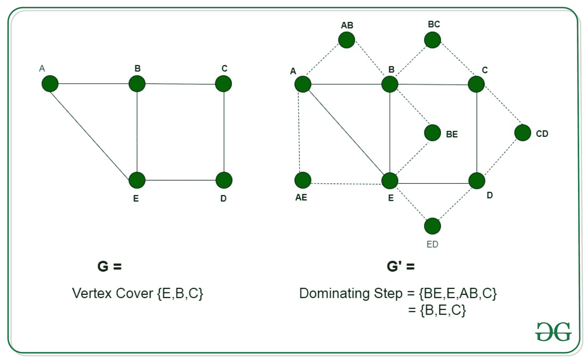

# 证明图的主导集是 NP 完整的

> 原文： [https://www.geeksforgeeks.org/proof-that-dominant-set-of-a-graph-is-np-complete/](https://www.geeksforgeeks.org/proof-that-dominant-set-of-a-graph-is-np-complete/)

**先决条件**：[图的支配集](https://www.geeksforgeeks.org/dominant-set-of-a-graph/)， [NP 完成](https://www.geeksforgeeks.org/np-completeness-set-1/)

> 图 **G =（V，E）**中的支配集是顶点 **V'**的子集，其条件是不属于 V'的顶点与 **V'**。

**问题**：给定一个图 **G（V，E）**和一个整数 k，问题在于确定该图是否具有大小为 k 的支配集。

**说明**：

问题的一个实例是为此问题指定的输入。 支配集问题的一个实例是图 G（V，E）和整数 k，问题是检查该图是否可以在 G 中具有支配集。由于 NP 完全问题的定义是 在 NP 和 NP 困难中都存在问题，证明问题是 NP 完全的陈述的证明包括两个部分：

1.  **Dominating Set is NP Complete**

    If any problem is in NP, then, given a ‘certificate’, which is a solution to the problem and an instance of the problem (a graph G and a positive integer k, in this case), we will be able to verify (check whether the solution given is correct or not) the certificate in polynomial time.

    The certificate is a sequence of vertices forming a Dominating Set in the graph. We can validate this solution by checking that all the vertices belong to the vertices of the graph and all the vertices that are not a part of this sequence are adjacent to some of the vertex in this set. This can be done in polynomial time, that is O(V +E) using the following strategy :

    ```
    flag=true
    for every vertex v in V:
      if v doesn't belong to Dominating Set:
         verify the set of edges 
         corresponding to v 
         if v is not adjacent 
            to any of the vertices in DS, 
            set flag=False and break
    if (flag)
       solution is correct
    else
       solution is incorrect

    ```

2.  **Dominating Set is NP-Hard**

    In order to prove that the Dominating Set is NP-Hard, we will have to reduce a known NP-Hard problem to this problem. We will carry out a reduction from the Vertex Cover problem to the Dominating Set problem.

    Every instance of the Vertex Cover problem consists of a graph **G = (V, E)** and an integer k consisting of the subset of vertices as the input can be converted to a Dominating Set problem consisting of graph **G’ = (V’, E’)**. We will construct the graph G’ in the following way:

    *   **E’** =对于图 G 中包含顶点{u，v}的每个边 E，添加一个新顶点{uv}并将其分别连接到新顶点 u 和 v。

    *   **V’** =将原始图形 G 的所有顶点 V 相加。

    通过添加与新顶点对应的新边（需要 *O（V + E）*时间），可以在多项式时间内获得新图形 G'。 可以通过以下两个权利要求证明这种减少：

    *   让我们假设图 G 具有大小为 k 的顶点覆盖 VC。 G 中的每个边都有一个属于顶点覆盖的顶点。 因此，对于每个由顶点{u，v}组成的边 e，至少 u 或 v 是顶点覆盖的一部分。 因此，如果 u 包含在 VC 中，则相邻顶点为 v，也将被 VC 中的某些元素覆盖。 现在，对于每个边的所有新添加的顶点 UV，顶点都与 u 和 v 相邻，其中一个至少是 VC 的一部分，如上所述。 因此，该 VC 也覆盖了所有边的附加顶点。 形成大小为 k 的顶点覆盖的一组顶点在图形 G’中形成支配集。 因此，如果 G 具有顶点覆盖，则 G’具有相同大小的主导集。

    *   我们假设图 G’具有大小为 k 的支配集。 可能出现两种可能，要么 DS 中的顶点是原始顶点，要么它属于每个边{u，v}的新添加的顶点 UV。 在第二种情况下，由于每个新顶点都连接到边的两个顶点 u 和 v，因此可以将其替换为 u 或 v。由于这三个顶点形成了三角形，因此即使替换视图也是如此。 使用 u 或 v，我们可以继续覆盖替换之前已覆盖的所有顶点。 这将导致消除所有新添加的顶点，同时跨越图形 G'的所有边。 新添加的顶点由修改后的 DS 主导，并且每个边 UV 至少用 u 或 v 覆盖 G 中的所有边。 因此，如果 G’具有大小为 k 的支配集，则 G 将具有最大为 k 的顶点覆盖。

在下图中，顶点 B 在 AB 和 BE 中均占主导地位，因此可以轻松地替换它。 因此，这两个顶点是多余的。



因此，我们可以说，图 G'包含主导集，而图 G 包含顶点覆盖。 因此，支配集问题的任何实例都可以简化为顶点覆盖问题的实例。 因此，主导集也是 NP-Hard。 由于顶点覆盖属于 NP 和 NP-Hard 类，因此图的主要 Set 是 NP-Complete。


* * *

* * *

如果您喜欢 GeeksforGeeks 并希望做出贡献，则还可以使用 [tribution.geeksforgeeks.org](https://contribute.geeksforgeeks.org/) 撰写文章，或将您的文章邮寄至 tribution@geeksforgeeks.org。 查看您的文章出现在 GeeksforGeeks 主页上，并帮助其他 Geeks。

如果您发现任何不正确的地方，请单击下面的“改进文章”按钮，以改进本文。