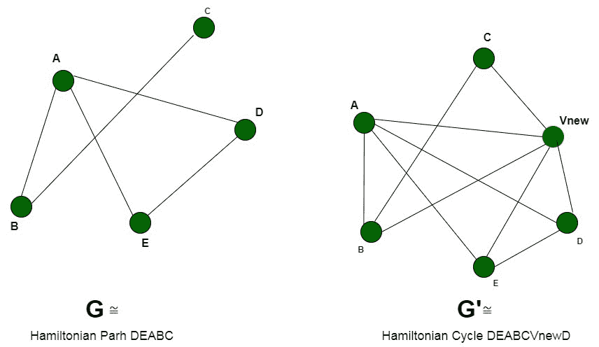

# 证明哈密顿循环是 NP 完整的

> 原文： [https://www.geeksforgeeks.org/proof-that-hamiltonian-cycle-is-np-complete/](https://www.geeksforgeeks.org/proof-that-hamiltonian-cycle-is-np-complete/)

**先决条件**：[NP 完整性](https://www.geeksforgeeks.org/np-completeness-set-1/)，[哈密顿循环](https://www.geeksforgeeks.org/hamiltonian-cycle-backtracking-6/)。

**哈密顿周期**：无向图 G =（V，E）中的一个周期，该周期恰好遍历每个顶点一次。

**问题陈述**：给定一个图 G（V，E），问题是要确定该图是否包含由属于 V 的所有顶点组成的哈密顿环。

**说明–**

问题的一个实例是为问题指定的输入。 独立集问题的一个实例是图 G（V，E），问题是检查该图是否可以在 G 中具有哈密顿循环。

由于 NP 完全问题从定义上讲是一个问题 NP 和 NP 都是硬性的，关于问题是 NP 完全的陈述的证明包括两个部分：

> 1.  问题本身在 NP 类中。
> 2.  NP 类中的所有其他问题都可以用多项式时间简化。
>     （B 是可简化为 C 的多项式时间，表示为  ）。

如果仅满足第二条件，则该问题称为 **NP-Hard** 。

但是不可能将每个 NP 问题都简化为另一个 NP 问题以始终显示其 NP 完整性。 这就是为什么如果我们想证明问题是 NP-Complete，我们只是证明问题出在 **NP** 中，并且如果可以解决 **NP-Complete** 问题，那么我们 完成，即如果 B 是 NP-Complete 且对于 NP 中的 C，则 C 是 NP-Complete。

1.  **Hamiltonian Cycle is in NP**

    If any problem is in NP, then, given a *‘certificate’*, which is a solution to the problem and an instance of the problem (a graph G and a positive integer k, in this case), we will be able to verify (check whether the solution given is correct or not) the certificate in polynomial time.

    The certificate is a sequence of vertices forming Hamiltonian Cycle in the graph. We can validate this solution by verifying that all the vertices belong to the graph and each pair of vertices belonging to the solution are adjacent. This can be done in polynomial time, that is **O(V +E)** using the following strategy for graph G(V, E):

    ```
    flag=true
    For every pair {u, v} in the subset V’:
        Check that these two have an edge between them
        If there is no edge, set flag to false and break
    If flag is true:
        Solution is correct
    Else:
        Solution is incorrect

    ```

2.  **Hamiltonian Cycle is NP Hard**

    In order to prove the Hamiltonian Cycle is NP-Hard, we will have to reduce a known NP-Hard problem to this problem. We will carry out a reduction from the [Hamiltonian Path problem](https://www.geeksforgeeks.org/proof-hamiltonian-path-np-complete/) to the Hamiltonian Cycle problem.

    Every instance of the Hamiltonian Path problem consisting of a graph **G =(V, E)** as the input can be converted to Hamiltonian Cycle problem consisting of graph **G’ = (V’, E’)**. We will construct the graph G’ in the following way:

    *   **V'** =添加原始图 G 的顶点 V 并添加一个附加顶点 **V <sub>新</sub>** ，以使该图连接的所有顶点都连接到该顶点 。 顶点数增加 1， **V’= V + 1** 。

    *   **E’** =添加原始图形 G 的边 E，并在新添加的顶点和图形的原始顶点之间添加新的边。 边数增加了顶点数 V，即 **E’= E + V** 。

    通过向新顶点添加新边（需要 O（V）时间），可以在多项式时间内获得新图形 G’。 可以通过以下两个权利要求证明这种减少：

    *   让我们假设图 G 包含一个覆盖图的`V`顶点的哈密顿路径，该顶点从一个随机顶点开始，例如 **V <sub>起点</sub>** 到终点 Vend，现在 因为我们将所有顶点连接到 G'中的任意新顶点 **V <sub>新</sub>** 。

        通过使用边线 **V <sub>端</sub>** 至 **V <sub>新</sub>** 和 V <sub>新的</sub>至 V <sub>分别启动</sub>。 现在，图形 **G’**包含一个遍历所有顶点的闭合循环。

    *   我们假设图 **G’**具有通过所有顶点的*哈密顿周期*，包括 **V <sub>新</sub>** 。 现在将其转换为*哈密顿路径*，我们在循环中移除了与顶点 **V <sub>新</sub>** 对应的边。 生成的路径将覆盖图形的顶点 V，并将仅覆盖它们一次。



因此，我们可以说图 **G’**包含*哈密顿循环*，而图`G`包含*哈密顿路径*。 因此，可以将*哈密顿循环*问题的任何实例简化为*哈密顿路径*问题的实例。 因此，*哈密顿循环*是 **NP-Hard** 。

**结论**：由于*哈密顿循环*都是 **NP 问题**和 **NP-Hard** 两者。 因此，这是一个 **NP 完全**问题。


* * *

* * *

如果您喜欢 GeeksforGeeks 并希望做出贡献，则还可以使用 [tribution.geeksforgeeks.org](https://contribute.geeksforgeeks.org/) 撰写文章，或将您的文章邮寄至 tribution@geeksforgeeks.org。 查看您的文章出现在 GeeksforGeeks 主页上，并帮助其他 Geeks。

如果您发现任何不正确的地方，请单击下面的“改进文章”按钮，以改进本文。