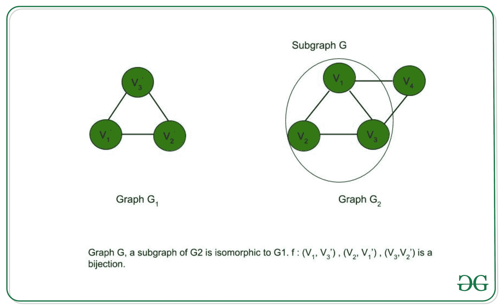

# 证明子图同构问题是 NP 完全

> 原文： [https://www.geeksforgeeks.org/proof-that-subgraph-isomorphism-problem-is-np-complete/](https://www.geeksforgeeks.org/proof-that-subgraph-isomorphism-problem-is-np-complete/)

**[子图同构问题](https://www.geeksforgeeks.org/mathematics-graph-isomorphisms-connectivity/)**：我们有两个无向图 G 1 和 G 2 。 问题是检查 G 1 是否与 G 2 的子图同构。

**图同构**：如果两个图 A 和 B 具有相同的顶点和边数，则它们是同构的，并且保留了边连通性。 在图 A 和 B 的顶点集之间存在双射。因此，当且仅当 f（u），f（v）在 B 中相邻时，两个顶点 u，v 在 A 中彼此相邻（f 是 a 双射）。

为了证明问题是 NP-完全的，我们必须证明它属于 NP 和 NP-Hard 类。 （由于 NP-完全问题是 NP-Hard 问题，也属于 NP）
 
**子图同构问题属于 NP –** 如果问题属于 对于 NP 类，则它应具有多项式时间可验证性。 给定证书，我们应该能够在多项式时间内验证它是否可以解决问题。

**证明**：

1.  <u>证书：</u>令 G 为 G 2 的子图。 我们也知道 G 1 和 G 的顶点之间的映射。
2.  <u>验证：</u>我们必须检查 G 1 是否与 G 同构。 （i）检查映射是否为双射，以及（ii）验证对于 G 1 中的每个边（u，v），是否存在边（f（u），f（v）） 存在于 G 中需要多项式时间。

因此，子图同构问题具有多项式时间可验证性，并且属于 NP 类。

**子图同构问题属于 NP-Hard –** 如果每个 NP 问题都可以在多项式时间内归纳为 L，则问题 L 属于 NP-Hard。 为了证明子图同构问题（S）是 NP-Hard，我们尝试将特定实例的已知 NP-Hard 问题简化为 S。 如果可以在多项式时间内进行这种减少，那么 S 也是 NP-Hard 问题。 因此，让我们将 NP 完全的集团决策问题（C）简化为子图同构问题（因此，NP 中的所有问题都可以在多项式时间内简化为 C）。 如果可以在多项式时间内进行这种缩减，则可以将每个 NP 问题在多项式时间内简化为 S，从而证明 S 为 NP-Hard。

**证明**：让我们证明集团决策问题在多项式时间内可以简化为子图同构问题。

让对集团决策问题的输入为（G，k）。 如果图 G 包含大小为 k 的集团（大小为 k 的集团是 G 的子图），则输出为 true。 令 G1 是 k 个顶点的完整图，而 G 2 是 G，其中 G 1 ，G 2 是子图同构问题的输入。 我们观察到 k < = n，其中 n 是 G 中的顶点数（= G 2 ）。 如果 k > n，则大小为 k 的集团不能是 G 的子图。创建 G 1 所需的时间为 O（k 2 ）= O（n 2 ）[因为 k < = n]作为大小为 k 的完整图中的边数= k C 2 = k *（k- 1）/ 2。 当且仅当 G1 是 G 2 的子图时，G 的大小为 k，因为 G 1 本身是 G 2 的子图，并且每个 图本身是同构的，子图同构问题的结果为真，因此，G 1 与 G 2 的子图同构。 因此，如果集团决策问题为真，则子图同构问题为真，反之亦然。 因此，对于特定实例，可以在多项式时间内将集团决策问题简化为子图同构问题。

因此，子图同构问题是 NP-Hard 问题

**结论**：
子图同构问题是 NP 和 NP-Hard。 因此，**子图同构问题是 NP-完全**。

* * *

* * *

如果您喜欢 GeeksforGeeks 并希望做出贡献，则还可以使用 [tribution.geeksforgeeks.org](https://contribute.geeksforgeeks.org/) 撰写文章，或将您的文章邮寄至 tribution@geeksforgeeks.org。 查看您的文章出现在 GeeksforGeeks 主页上，并帮助其他 Geeks。

如果您发现任何不正确的地方，请单击下面的“改进文章”按钮，以改进本文。