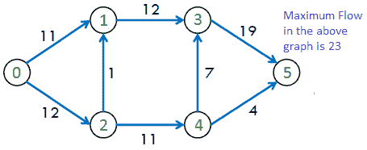
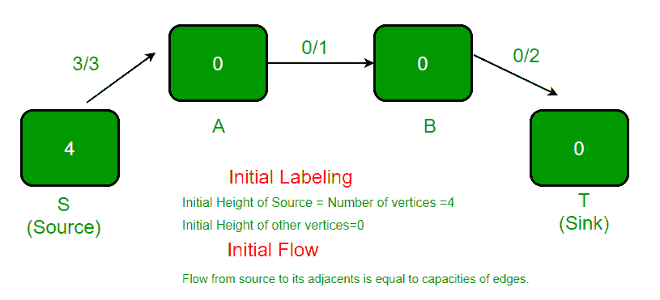
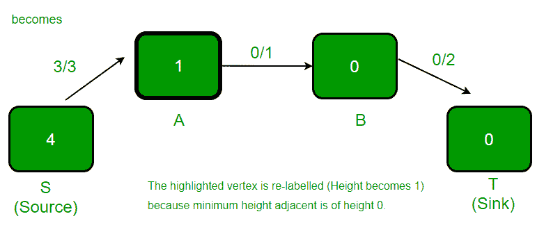
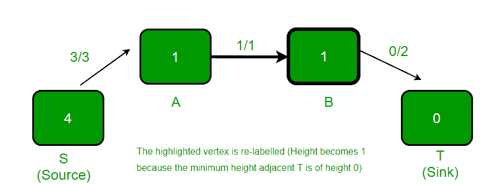
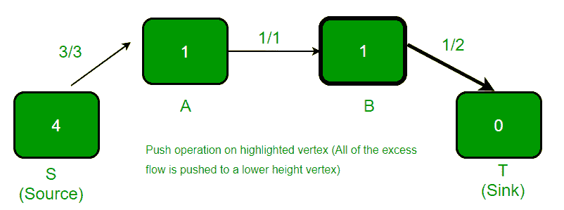
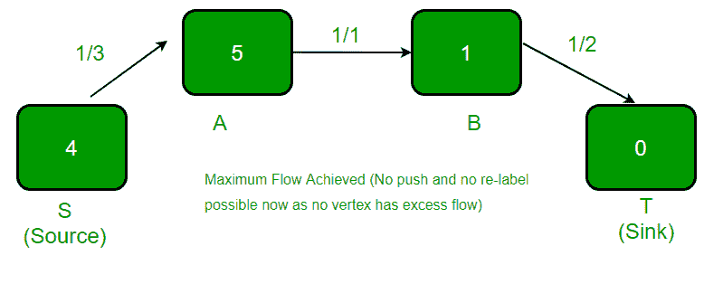

# 推送重新标记算法| 第 1 组（简介和插图）

> 原文： [https://www.geeksforgeeks.org/push-relabel-algorithm-set-1-introduction-and-illustration/](https://www.geeksforgeeks.org/push-relabel-algorithm-set-1-introduction-and-illustration/)

给定一个表示流网络的图形，其中每个边都有容量。 还给定图中的两个顶点*源*'s'和*接收器*'t'，请找到具有以下约束的从 s 到 t 的最大可能流量：

**a）**边上的流量不超过边的给定容量。

**b）**除 s 和 t 之外，每个顶点的流入流量等于流出流量。

例如，请考虑以下 CLRS 书中的图表。


上图中的最大可能流量为 23。



我们已经讨论了 [Ford Fulkerson 算法](https://www.geeksforgeeks.org/ford-fulkerson-algorithm-for-maximum-flow-problem/)，该算法使用扩展路径来计算最大流量。

**Push-Relabel Algorithm**

Push-Relabel 方法比 Ford-Fulkerson 算法更有效。 本文讨论了 Goldberg 的“通用”最大流量算法，该算法以 **O（V <sup>2</sup> E）**时间运行。 此时间复杂度优于 O（E <sup>2</sup> V），后者是 Edmond-Karp 算法（基于 BFS 的 Ford-Fulkerson 实现）的时间复杂度。 存在一种基于推入-重新标记方法的算法，该算法可在 O（V <sup>3</sup> ）中工作，甚至比这里讨论的算法更好。

**与福特富尔克森**相似

*   与 Ford-Fulkerson 一样，Push-Relabel 也可用于残差图（流网络的残差图是指示其他可能流量的图。如果残差图中存在从源到汇的路径，则可以添加流量） 。

**与福特富尔克森**的区别

*   推入重贴标签算法在更局限的地方工作。 推入重贴标签算法一次不会在一个顶点上工作，而不是检查整个残差网络以找到增广路径（来源：CLRS 书）。

*   在 Ford-Fulkerson 中，每个顶点（源和汇除外）的总流出和总流入之间的净差保持为 0。Push-Relabel 算法允许流入超过最终流出之前的流出。 在最终流中，除源和接收器外，所有其他器的净差为 0。

*   时间复杂度明智地提高了效率。

推入重贴标签算法（考虑流体流动问题）背后的直觉是，我们将边视为水管和节点是关节。 该水源被认为是最高水位，它将水输送到所有相邻节点。 一旦节点中有多余的水，它会**将**水推到较小的节点。 如果水被局部困在顶点处，则顶点被**重新标记为**，这意味着其高度会增加。

以下是在进行算法之前要考虑的一些有用事实。

*   每个顶点都有一个高度变量和一个多余流量。 **高度**用于确定某个顶点是否可以将流推向相邻顶点（一个顶点只能将流推向较小的高度顶点）。 **多余流量**是流入顶点的总流量减去流出顶点的总流量之差。

    ```
         Excess Flow of u = Total Inflow to u - 
                            Total Outflow from u
    ```

*   像福特富尔克森。 每个边都有一个**流量**（指示电流）和一个**容量**

以下是完整算法的抽象步骤。

```
Push-Relabel Algorithm 
1) Initialize PreFlow : Initialize Flows 
   and Heights 

2) While it is possible to perform a Push() or 
   Relablel() on a vertex
   // Or while there is a vertex that has excess flow
           Do Push() or Relabel()

// At this point all vertices have Excess Flow as 0 (Except source
// and sink)
3) Return flow.

```

Push-Relabel 算法中有三个主要操作

1.  **初始化 PreFlow（）**初始化所有顶点的高度和流动。

    ```
    Preflow() 
    1) Initialize height and flow of every vertex as 0.
    2) Initialize height of source vertex equal to total 
       number of vertices in graph.
    3) Initialize flow of every edge as 0.
    4) For all vertices adjacent to source s, flow and  
       excess flow is equal to capacity initially.
    ```

2.  **Push（）**用于从流量过大的节点产生流量。 如果顶点有多余的流动，并且有一个相邻的高度较小（在残差图中），我们将流动从顶点推到相邻的较低高度。 通过管道（边）的推动流量等于多余流量和边容量的最小值。

3.  **Relabel（）**操作用于顶点流动过多且相邻顶点都不处于较低高度的情况。 我们基本上增加了顶点的高度，以便可以执行 push（）。 为了增加高度，我们选择相邻的最小高度（在残差图中，即可以添加流量的相邻高度）并对其加 1。

注意，以上操作是在残差图上执行的（例如 [Ford-Fulkerson](https://www.geeksforgeeks.org/ford-fulkerson-algorithm-for-maximum-flow-problem/) ）。

<center>**Illustration:**</center>

Before we proceed to below example, we need to make sure that we understand residual graph (See [this](https://www.geeksforgeeks.org/ford-fulkerson-algorithm-for-maximum-flow-problem/) for more details of residual graph). Residual graph is different from graphs shown.

每当我们将顶点 u 的流量推入或添加到 v 时，我们都会在残差图中进行以下更新：

1.  我们从 u 到 v 的边容量中减去流量。如果边的容量变为 0，则 边不再存在于残差图中。

2.  我们将流量增加到从 v 到 u 的边容量。

```
For example, consider two vertices u an v.

In original graph
        3/10
   u ---------> v
    3 is current flow from u to v and
    10 is capacity of edge from u to v.

In residual Graph, there are two edges corresponding
to one edge shown above.
         7
   u ---------> v

         3
   u <--------- v 
```

1.  初始给定流程图。

    

.

3.  在 PreFlow 操作之后。 在残差图中，从 A 到 S 的边为容量 3，从 S 到 A 的边为无。

    

.

5.  高亮显示的顶点被重新标记（高度变为 1），因为它有过多的流量，并且没有相邻的顶点具有较小的高度。 新高度等于相邻高度的最小值加 1.在残差图中，顶点 A 有两个相邻，一个是 S，另一个是 B.S 的高度是 4，B 的高度是 0.这两个的最小值 heights 是 0。我们取最小值并加 1。

    

.

7.  突出显示的顶点有过多的流动，并且相邻的顶点的高度较低，因此发生 push（）。 顶点 A 的多余流量为 2，边（A，B）的容量为 1。因此，推动的流量为 1（两个值的最小值）。

    

.

11.  高亮显示的顶点被重新标记（高度变为 1），因为它有过多的流量，并且没有相邻的顶点具有较小的高度。

    

.

13.  高亮显示的顶点有多余的流量，并且相邻顶点的高度较低，因此 flow（）从 B 推到 T。

    

.

15.  高亮显示的顶点被重新标记（高度变为 5），因为它有过多的流量，并且没有相邻的顶点具有较小的高度。

    

.

17.  突出显示的顶点有过多的流动，并且相邻的顶点的高度较低，因此发生 push（）。

    

.

19.  高亮显示的顶点被重新标记（高度增加 1），因为它有过多的流量，并且没有相邻的顶点具有较小的高度。

    

上面的示例取自[此处](http://melodi.ee.washington.edu/~bilmes/grg/pushrelabel1.ppt)。

[推送重新标记算法| 第 2 组（实施）](https://www.geeksforgeeks.org/push-relabel-algorithm-set-2-implementation/)

本文由 **Siddharth Lalwani** 提供。 如果您喜欢 GeeksforGeeks 并希望做出贡献，那么您也可以写一篇文章，并将您的文章邮寄到 contribution@geeksforgeeks.org。 查看您的文章出现在 GeeksforGeeks 主页上，并帮助其他 Geeks。

如果发现任何不正确的地方，或者想分享有关上述主题的更多信息，请发表评论。

