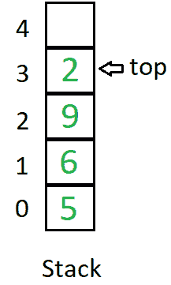
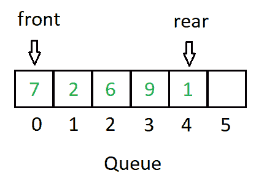
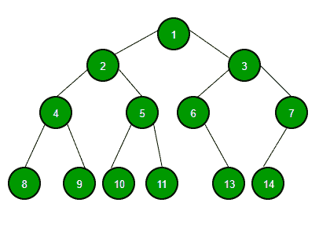
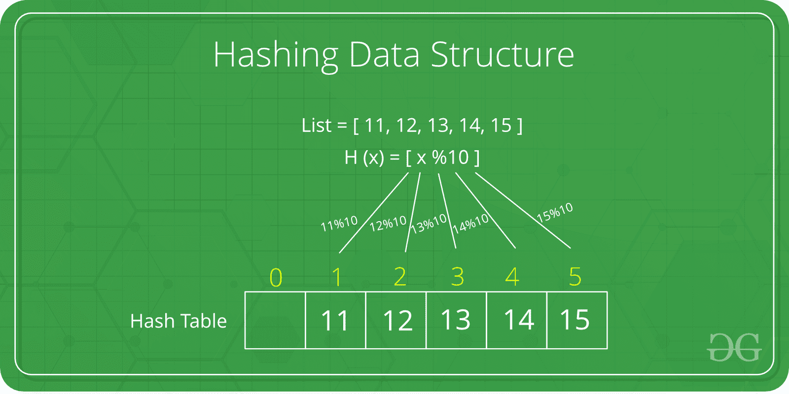
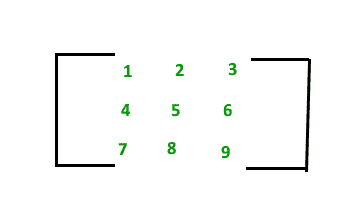

# 数据结构的实时应用

[数据结构](https://www.geeksforgeeks.org/data-structures/)是在计算机中组织数据的一种特殊方式，因此可以有效地使用它。 本文讨论了所有数据结构的实时应用。

### [阵列](https://www.geeksforgeeks.org/array-data-structure/)的应用：

数组是存储相同数据类型的项的最简单的数据结构。 数组的基本应用可以以表格格式存储数据。 例如，如果我们希望将联系人存储在手机上，则该软件将简单地将所有联系人放置在一个数组中。

数组的其他一些应用是：

1.  可以简单地通过数组来存储游戏的排行榜，以存储分数并将其按降序排列以清楚地确定游戏中每个玩家的排名。

2.  一个简单的问题论文是一系列编号问题，每个问题都分配有一些分数。

3.  [2D 阵列](https://www.geeksforgeeks.org/multidimensional-arrays-in-java/)（通常称为矩阵）用于图像处理。

4.  它也用于语音处理，其中每个语音信号是一个数组。

### [链接列表的应用](https://www.geeksforgeeks.org/applications-of-linked-list-data-structure/)：

[链表](http://www.geeksforgeeks.org/data-structures/linked-list/)是一种序列数据结构，它通过链接连接称为节点的元素。

链表的其他一些应用程序是：

1.  图像相互链接。 因此，图像查看器软件使用链接列表通过上一个和下一个按钮查看上一个和下一个图像。

2.  可以使用通过链接列表链接的上一个和下一个 URL 链接来访问网页。

3.  音乐播放器也使用相同的技术在音乐之间切换。

4.  为了跟踪多人游戏中的回合，使用了[循环链接列表](https://www.geeksforgeeks.org/circular-linked-list/)。

### [堆栈](https://www.geeksforgeeks.org/stack-data-structure-introduction-program/)的应用：

堆栈是一种使用 [LIFO 顺序](https://www.geeksforgeeks.org/lifo-last-in-first-out-approach-in-programming/)的数据结构。

堆栈的一些应用程序是：

1.  将中缀转换为后缀表达式。

2.  还可以通过堆栈执行撤消操作。

3.  语言中的语法使用堆栈进行解析。

4.  它用于许多虚拟机，例如 [JVM](https://www.geeksforgeeks.org/jvm-works-jvm-architecture/) 。

### [队列](https://www.geeksforgeeks.org/applications-of-queue-data-structure/)的应用：

队列是使用 [FIFO 顺序](https://www.geeksforgeeks.org/fifo-first-in-first-out-approach-in-programming/)的数据结构。

队列的一些应用程序是：

1.  [操作系统](https://www.geeksforgeeks.org/types-of-operating-systems/)使用队列进行作业调度。

2.  为了处理网络队列中的拥塞，可以使用。

3.  通信中的数据包以队列格式排列。

### [图形](https://www.geeksforgeeks.org/applications-of-graph-data-structure/)的应用：

[图](https://www.geeksforgeeks.org/graph-data-structure-and-algorithms/)是一种数据结构，其中数据存储在互连的顶点（节点）和边（路径）的集合中。

图的一些应用是：

1.  Facebook 的 Graph API 使用 Graphs 的结构。

2.  Google 的知识图还必须与图做一些事情。

3.  Dijkstra 算法或最短路径优先算法也使用图结构来查找图节点之间的最小路径。

4.  GPS 导航系统还使用最短路径 API。

### [树](https://www.geeksforgeeks.org/applications-of-tree-data-structure/)的应用：

树是具有单个根节点的层次结构。

树的一些应用是：

1.  XML Parser 使用树算法。

2.  基于决策的算法用于机器学习中，它基于树的算法。

3.  数据库还使用树数据结构进行索引。

4.  域名服务器（DNS）也使用树结构。

### [哈希表](https://www.geeksforgeeks.org/applications-of-hashing/)的应用：

哈希表以键值对的形式存储数据。 它仅存储具有关联的密钥的数据。 使用哈希表时，插入和搜索操作易于管理。

哈希表的一些应用程序是：

1.  存储在数据库中的数据通常是通过哈希表完成的键值格式。

2.  每次我们在 Google chrome 或其他浏览器中键入要搜索的内容时，它都会根据哈希原理生成所需的输出。

3.  Message Digest 是一种加密功能，它还使用散列以如下方式创建输出：从生成的输出到达原始输入几乎几乎是不可能的。

4.  在我们的计算机中，我们存储了各种文件，每个文件都有两个非常关键的信息，即文件名和文件路径，以便在文件名与其对应的文件路径哈希表之间建立连接。

### [堆](https://www.geeksforgeeks.org/applications-of-heap-data-structure/)的应用：

堆是二叉树的一种特殊情况，其中将父节点与其子节点的值进行比较，并对其进行相应排列。

堆的一些应用程序是：

1.  在[堆排序算法](https://www.geeksforgeeks.org/heap-sort/)中，该算法可对[最小堆](https://www.geeksforgeeks.org/min-heap-in-java/)（父项的密钥小于或等于其子项的密钥）或[最大堆中的元素进行排序](https://www.geeksforgeeks.org/max-heap-in-java/) （父项的密钥大于或等于其子项的密钥），[排序](http://www.geeksforgeeks.org/sorting-algorithms/)是通过创建堆来完成的。

2.  堆用于实现[优先级队列](https://www.geeksforgeeks.org/priority-queue-set-1-introduction/)，其中优先级基于创建的堆的顺序。

3.  与安全相关的系统和嵌入式系统（例如 Linux Kernel）由于使用 O（n log（n））而使用堆排序。

4.  如果我们在寻找 [K 数的最小（或最大）值](https://www.geeksforgeeks.org/kth-smallestlargest-element-unsorted-array/)时陷入困境，那么堆可以轻松快捷地解决问题。

### [矩阵](https://www.geeksforgeeks.org/matrix/)的应用：

矩阵是元素的列和行的有序集合。 必须将矩阵的元素括在方括号内。

矩阵的一些应用是：

1.  在地质学中，矩阵用于进行地震勘测。

2.  用于绘制图形，统计数据，还用于几乎不同领域的科学研究和研究。

3.  矩阵还用于表示现实世界的数据，例如人口，婴儿死亡率等。

4.  它们是用于绘制调查的最佳表示方法。

* * *

* * *

