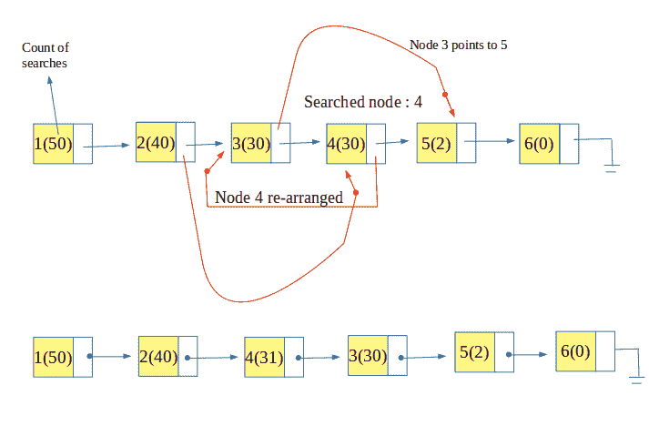

# 自组织列表：计数方法

[自组织列表](https://www.geeksforgeeks.org/self-organizing-list-set-1-introduction/)是重新组织或重新安排自身以获得更好性能的列表。 在一个简单列表中，以顺序方式查找要搜索的项目，该方式给出了 O（n）的时间复杂度。 但是在实际情况下，并非所有项目都会被频繁搜索，并且在大多数情况下，只有很少的项目会被多次搜索。

因此，自组织列表使用此属性（也称为参考位置）将最常用的项目放在列表的顶部。 这增加了在列表的开头找到该项目的可能性，并且那些很少使用的元素被推到列表的后面。

在**计数方法**中，对每个节点被搜索的次数进行计数（即，保持搜索频率）。 因此，每个节点都会关联一个额外的存储空间，每次搜索一个节点时，存储空间就会增加。 然后，节点以其搜索的次数或频率不递增的顺序排列。 因此，这可确保将最常访问的节点保留在列表的开头。



例子：

```
Input : list : 1, 2, 3, 4, 5
        searched : 4 
Output : list : 4, 1, 2, 3, 5

Input : list : 4, 1, 2, 3, 5
        searched : 5
        searched : 5
        searched : 2
Output : list : 5, 2, 4, 1, 3
Explanation : 5 is searched 2 times (i.e. the 
most searched) 2 is searched 1 time and 4 is 
also searched 1 time (but since 2 is searched 
recently, it is kept ahead of 4) rest are not 
searched, so they maintained order in which
they were inserted.

```

```

// CPP Program to implement self-organizing list 
// using count method 
#include <iostream> 
using namespace std; 

// structure for self organizing list 
struct self_list { 
    int value; 
    int count; 
    struct self_list* next; 
}; 

// head and rear pointing to start and end of list resp. 
self_list *head = NULL, *rear = NULL; 

// function to insert an element 
void insert_self_list(int number) 
{ 
    // creating a node 
    self_list* temp = (self_list*)malloc(sizeof(self_list)); 

    // assigning value to the created node; 
    temp->value = number; 
    temp->count = 0; 
    temp->next = NULL; 

    // first element of list 
    if (head == NULL) 
        head = rear = temp; 

    // rest elements of list 
    else { 
        rear->next = temp; 
        rear = temp; 
    } 
} 

// function to search the key in list 
// and re-arrange self-organizing list 
bool search_self_list(int key) 
{ 
    // pointer to current node 
    self_list* current = head; 

    // pointer to previous node 
    self_list* prev = NULL; 

    // searching for the key 
    while (current != NULL) { 

        // if key is found 
        if (current->value == key) { 

            // increment the count of node 
            current->count = current->count + 1; 

            // if it is not the first element 
            if (current != head) { 
                self_list* temp = head; 
                self_list* temp_prev = NULL; 

                // finding the place to arrange the searched node 
                while (current->count < temp->count) { 
                    temp_prev = temp; 
                    temp = temp->next; 
                } 

                // if the place is other than its own place 
                if (current != temp) { 
                    prev->next = current->next; 
                    current->next = temp; 

                    // if it is to be placed at beginning 
                    if (temp == head) 
                        head = current; 
                    else
                        temp_prev->next = current; 
                } 
            } 
            return true; 
        } 
        prev = current; 
        current = current->next; 
    } 
    return false; 
} 

// function to display the list 
void display() 
{ 
    if (head == NULL) { 
        cout << "List is empty" << endl; 
        return; 
    } 

    // temporary pointer pointing to head 
    self_list* temp = head; 
    cout << "List: "; 

    // sequentially displaying nodes 
    while (temp != NULL) { 
        cout << temp->value << "(" << temp->count << ")"; 
        if (temp->next != NULL) 
            cout << " --> "; 

        // incrementing node pointer. 
        temp = temp->next; 
    } 
    cout << endl 
         << endl; 
} 

// Driver Code 
int main() 
{ 
    /* inserting five values */
    insert_self_list(1); 
    insert_self_list(2); 
    insert_self_list(3); 
    insert_self_list(4); 
    insert_self_list(5); 

    // Display the list 
    display(); 

    search_self_list(4); 
    search_self_list(2); 
    display(); 

    search_self_list(4); 
    search_self_list(4); 
    search_self_list(5); 
    display(); 

    search_self_list(5); 
    search_self_list(2); 
    search_self_list(2); 
    search_self_list(2); 
    display(); 
    return 0; 
} 

```

输出：

```
List: 1(0) --> 2(0) --> 3(0) --> 4(0) --> 5(0)
List: 2(1) --> 4(1) --> 1(0) --> 3(0) --> 5(0)
List: 4(3) --> 5(1) --> 2(1) --> 1(0) --> 3(0)
List: 2(4) --> 4(3) --> 5(2) --> 1(0) --> 3(0)

```


* * *

* * *

如果您喜欢 GeeksforGeeks 并希望做出贡献，则还可以使用 [tribution.geeksforgeeks.org](https://contribute.geeksforgeeks.org/) 撰写文章，或将您的文章邮寄至 tribution@geeksforgeeks.org。 查看您的文章出现在 GeeksforGeeks 主页上，并帮助其他 Geeks。

如果您发现任何不正确的地方，请单击下面的“改进文章”按钮，以改进本文。