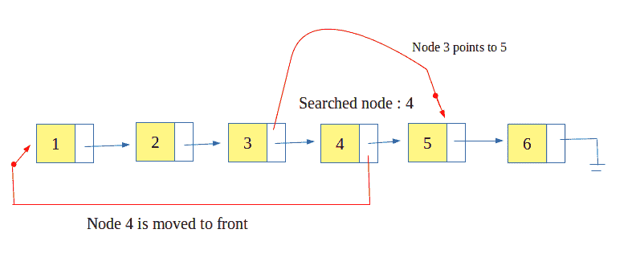

# 自组织列表：转到最前面的方法

> 原文：[https://www.geeksforgeeks.org/self-organizing-list-move-front-method/](https://www.geeksforgeeks.org/self-organizing-list-move-front-method/)

[自组织列表](https://www.geeksforgeeks.org/self-organizing-list-set-1-introduction/)是重新组织或重新安排自身以获得更好性能的列表。 在一个简单列表中，以顺序方式查找要搜索的项目，该方式给出了`O(n)`的时间复杂度。 但是在实际情况下，并非所有项目都会被频繁搜索，并且在大多数情况下，只有很少的项目会被多次搜索。

因此，自组织列表使用此属性（也称为参考的**局部性）将最常用的项目放在列表的顶部。 这增加了在列表的开头找到该项目的可能性，并且那些很少使用的元素被推到列表的后面。**

在**移到最前面的方法**中，最近搜索的项目被移到列表的最前面。 因此，此方法很容易实现，但也将不经常搜索的项目移到最前面。 将不频繁搜索的项目移到最前面是此方法的一大缺点，因为它会影响访问时间。




例子：

```
Input :   list : 1, 2, 3, 4, 5, 6
          searched: 4 
Output :  list : 4, 1, 2, 3, 5, 6

Input :   list : 4, 1, 2, 3, 5, 6
          searched : 2
Output :  list : 2, 4, 1, 3, 5, 6

```

```

// CPP Program to implement self-organizing list 
// using move to front method 
#include <iostream> 
using namespace std; 

// structure for self organizing list 
struct self_list { 
    int value; 
    struct self_list* next; 
}; 

// head and rear pointing to start and end of list resp. 
self_list *head = NULL, *rear = NULL; 

// function to insert an element 
void insert_self_list(int number) 
{ 
    // creating a node 
    self_list* temp = (self_list*)malloc(sizeof(self_list)); 

    // assigning value to the created node; 
    temp->value = number; 
    temp->next = NULL; 

    // first element of list 
    if (head == NULL) 
        head = rear = temp; 

    // rest elements of list 
    else { 
        rear->next = temp; 
        rear = temp; 
    } 
} 

// function to search the key in list 
// and re-arrange self-organizing list 
bool search_self_list(int key) 
{ 
    // pointer to current node 
    self_list* current = head; 

    // pointer to previous node 
    self_list* prev = NULL; 

    // searching for the key 
    while (current != NULL) { 

        // if key found 
        if (current->value == key) { 

            // if key is not the first element 
            if (prev != NULL) { 

                /* re-arranging the elements */
                prev->next = current->next; 
                current->next = head; 
                head = current; 
            } 
            return true; 
        } 
        prev = current; 
        current = current->next; 
    } 

    // key not found 
    return false; 
} 

// function to display the list 
void display() 
{ 
    if (head == NULL) { 
        cout << "List is empty" << endl; 
        return; 
    } 

    // temporary pointer pointing to head 
    self_list* temp = head; 
    cout << "List: "; 

    // sequentially displaying nodes 
    while (temp != NULL) { 
        cout << temp->value; 
        if (temp->next != NULL) 
            cout << " --> "; 

        // incrementing node pointer. 
        temp = temp->next; 
    } 
    cout << endl  << endl; 
} 

// Driver Code 
int main() 
{ 
    /* inserting five values */
    insert_self_list(1); 
    insert_self_list(2); 
    insert_self_list(3); 
    insert_self_list(4); 
    insert_self_list(5); 

    // Display the list 
    display(); 

    // search 4 and if found then re-arrange 
    if (search_self_list(4)) 
        cout << "Searched: 4" << endl; 
    else
        cout << "Not Found: 4" << endl; 

    // Display the list 
    display(); 

    // search 2 and if found then re-arrange 
    if (search_self_list(2)) 
        cout << "Searched: 2" << endl; 
    else
        cout << "Not Found: 2" << endl; 
    display(); 

    return 0; 
} 

```

输出：

```
List: 1 --> 2 --> 3 --> 4 --> 5

Searched: 4
List: 4 --> 1 --> 2 --> 3 --> 5

Searched: 2
List: 2 --> 4 --> 1 --> 3 --> 5

```


* * *

* * *

如果您喜欢 GeeksforGeeks 并希望做出贡献，则还可以使用 [tribution.geeksforgeeks.org](https://contribute.geeksforgeeks.org/) 撰写文章，或将您的文章邮寄至 tribution@geeksforgeeks.org。 查看您的文章出现在 GeeksforGeeks 主页上，并帮助其他 Geeks。

如果您发现任何不正确的地方，请单击下面的“改进文章”按钮，以改进本文。