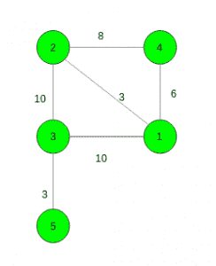
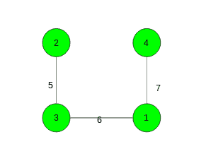

# 从源到目的地的最短路径，使得沿路径的边权重交替增加和减少

> 原文： [https://www.geeksforgeeks.org/shortest-path-from-source-to-destination-such-that-edge-weights-along-path-are-alternatively-increasing-and-decreasing/](https://www.geeksforgeeks.org/shortest-path-from-source-to-destination-such-that-edge-weights-along-path-are-alternatively-increasing-and-decreasing/)

给定一个具有`N`个顶点和`M`边的连通图。 任务是找到从源到目标顶点的最短路径，以使最短路径中相邻边权重之间的差从正变负，反之亦然（权重（E1）>权重（E2）< （E3）…。）。 如果不存在这样的路径，则打印`-1`。

**示例**：

> **输入**：源= 4，目标= 3
> 
> **输出**：19
> 4 – 2 – 1 – 3（边权重：8、3 ，10）和 4 – 1 – 2 – 3（边权重：6、3、10）是唯一有效的路径。
> 第二条路径花费的成本最低，即 19。
> 
> **输入**：源= 2，目标= 4
> 
> **输出**：-1
> 不存在这样的路径。

**方法**：在这里，我们需要保留相邻列表的两个副本，一个用于正向差异，另一个用于负向差异。 与 [Dijkstras 算法](https://www.geeksforgeeks.org/dijkstras-shortest-path-algorithm-greedy-algo-7/)一样，采用[优先级队列](https://www.geeksforgeeks.org/priority-queue-set-1-introduction/)，并一次保留四个变量，即，

1.  **成本**：存储到当前节点为止的路径成本。
2.  **阶段**：一个整数变量，用于指示下一步需要采取的元素，如果前一个值为负，则需要为正值，否则为负。
3.  **权重**：最后访问的节点的权重。
4.  **顶点**：上次访问的顶点。

对于每个顶点，根据所需条件（阶段值）推入相邻的顶点。 请参阅代码以获得更好的理解。

下面是上述方法的实现：

```

// C++ implementation of the approach 
#include <bits/stdc++.h> 
using namespace std; 
#define N 100005 

// To store the graph 
vector<pair<int, int> > incr[N], decr[N]; 
int _incr[N], _decr[N], shortest[N]; 

int n, m, src, dest, MAXI = 1LL << 30; 

// Function to add edges 
void Add_edge(int x, int y, int w) 
{ 
    incr[x].push_back({ w, y }); 
    incr[y].push_back({ w, x }); 
    decr[x].push_back({ -w, y }); 
    decr[y].push_back({ -w, x }); 
} 

// Function to find the shortest distance from 
// source to destination 
int Modified_Dijkstra() 
{ 

    // Total cost, stage, weight of previous, vertex 
    priority_queue<pair<pair<int, int>, pair<int, int> > > q; 

    // Sort the edges 
    for (int i = 1; i <= n; i++) { 
        sort(incr[i].begin(), incr[i].end()); 
        sort(decr[i].begin(), decr[i].end()); 
    } 

    for (int i = 1; i <= n; i++) 
        shortest[i] = MAXI; 

    // Push the source vertex 
    q.push({ { 0, 0 }, { 0, src } }); 

    while (!q.empty()) { 

        // Take the top element in the queue 
        pair<pair<int, int>, pair<int, int> > FRONT = q.top(); 

        // Remove it from the queue 
        q.pop(); 

        // Store all the values 
        int cost = -FRONT.first.first; 
        int stage = FRONT.first.second; 
        int weight = FRONT.second.first; 
        int v = FRONT.second.second; 

        // Take the minimum cost for the vertex 
        shortest[v] = min(shortest[v], cost); 

        // If destination vertex has already been visited 
        if (shortest[dest] != MAXI) 
            break; 

        // To make difference negative 
        if (stage) { 

            // Start from last not visited vertex 
            for (int i = _incr[v]; i < incr[v].size(); i++) { 

                // If we can take the ith vertex 
                if (weight > incr[v][i].first) 
                    q.push({ { -(cost + incr[v][i].first), 0 }, 
                             { incr[v][i].first, incr[v][i].second } }); 
                else { 

                    // To keep the last not visited vertex 
                    _incr[v] = i; 
                    break; 
                } 
            } 
        } 

        // To make difference positive 
        else { 

            // Start from last not visited vertex 
            for (int i = _decr[v]; i < decr[v].size(); i++) { 

                // If we can take the ith vertex 
                if (weight < -decr[v][i].first) 
                    q.push({ { -(cost - decr[v][i].first), 1 }, 
                             { -decr[v][i].first, decr[v][i].second } }); 
                else { 

                    // To keep the last not visited vertex 
                    _decr[v] = i; 
                    break; 
                } 
            } 
        } 
    } 

    if (shortest[dest] == MAXI) 
        return -1; 

    return shortest[dest]; 
} 

// Driver code 
int main() 
{ 
    n = 5, src = 4, dest = 3; 

    // Adding edges 
    Add_edge(4, 2, 8); 
    Add_edge(1, 4, 6); 
    Add_edge(2, 3, 10); 
    Add_edge(3, 1, 10); 
    Add_edge(1, 2, 3); 
    Add_edge(3, 5, 3); 

    cout << Modified_Dijkstra(); 

    return 0; 
} 

```

**Output:**

```
19

```


* * *

* * *

如果您喜欢 GeeksforGeeks 并希望做出贡献，则还可以使用 [tribution.geeksforgeeks.org](https://contribute.geeksforgeeks.org/) 撰写文章，或将您的文章邮寄至 tribution@geeksforgeeks.org。 查看您的文章出现在 GeeksforGeeks 主页上，并帮助其他 Geeks。

如果您发现任何不正确的地方，请单击下面的“改进文章”按钮，以改进本文。