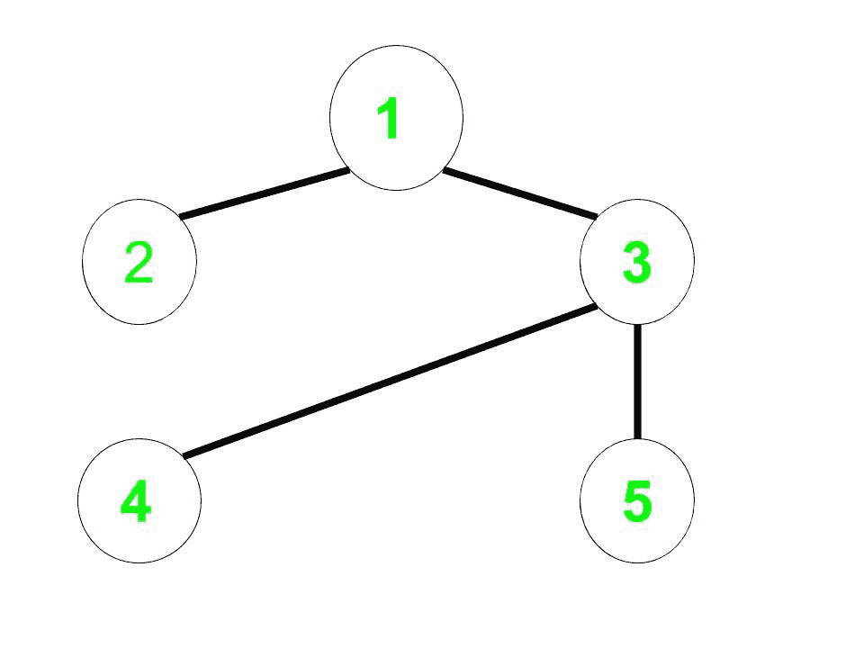
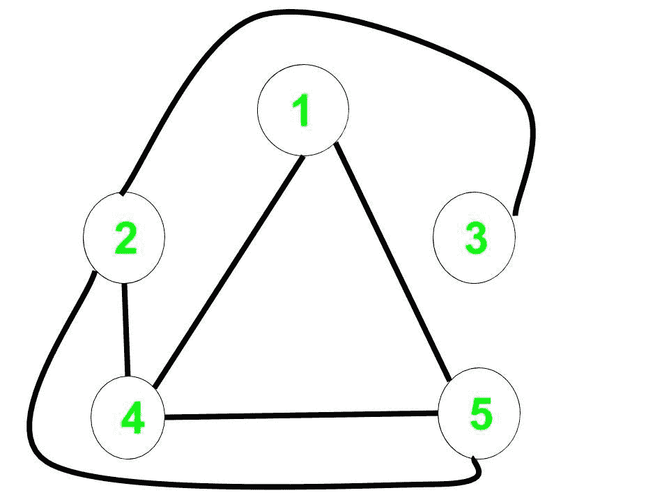

# 补图

中的最短路径

> 原文： [https://www.geeksforgeeks.org/shortest-path-in-a-complement-graph/](https://www.geeksforgeeks.org/shortest-path-in-a-complement-graph/)

给定**无向非加权图 G** 。 对于给定的节点**，起点**返回最短路径，该路径是从起点到 G 的互补图中所有节点的边数。

> **补图**是一个图形，它仅包含原始图形中不存在的那些边。

**示例：**

> **输入：**无向边=（1、2），（1、3），（3、4），（3、5），开始= 1
> **输出：** 0 2 3 1 1
> **解释：**
> **原始图形：**
> 
> [](https://media.geeksforgeeks.org/wp-content/uploads/20200701031811/GFG136.jpg)
> 
> **补图：** [
> 
> [](https://media.geeksforgeeks.org/wp-content/uploads/20200701032219/Untitled-drawing48-3.jpg)
> 
> 从 1 到补图中每个节点的距离为：
> 1 至 1 = 0，
> 1 至 2 = 2，
> 1 至 3 = 3，
> 1 至 4 = 1，
> 1 至 5 = 1

**天真的方法：**一个简单的解决方案是创建补图，并在该图上使用[广度优先搜索](https://www.geeksforgeeks.org/breadth-first-search-or-bfs-for-a-graph/)来查找到所有节点的距离。

 ***时间复杂度：** O（n <sup>2</sup> ）用于创建补图，而 O（n + m）用于广度优先搜索。

**高效方法：**的想法是使用**改进的广度优先搜索**来计算答案，然后无需构造补图。

*   对于每个顶点或节点，减小顶点的距离，该距离是当前顶点的补充，尚未被发现。
*   对于这个问题，我们必须观察到，如果图是稀疏的，那么未发现的节点将被非常快速地访问。

下面是上述方法的实现：

## C ++

```

// C++ implementation to find the 
// shortest path in a complement graph 

#include <bits/stdc++.h> 
using namespace std; 

const int inf = 100000; 

void bfs(int start, int n, int m, 
         map<pair<int, int>, int> edges) 
{ 
    int i; 

    // List of undiscovered vertices 
    // initially it will contain all 
    // the vertices of the graph 
    set<int> undiscovered; 

    // Distance will store the distance 
    // of all vertices from start in the 
    // complement graph 
    vector<int> distance_node(10000); 

    for (i = 1; i <= n; i++) { 

        // All vertices are undiscovered 
        undiscovered.insert(i); 

        // Let initial distance be infinity 
        distance_node[i] = inf; 
    } 

    undiscovered.erase(start); 
    distance_node[start] = 0; 
    queue<int> q; 

    q.push(start); 

    // Check if queue is not empty and the 
    // size of undiscovered vertices 
    // is greater than 0 
    while (undiscovered.size() && !q.empty()) { 
        int cur = q.front(); 
        q.pop(); 

        // Vector to store all the complement 
        // vertex to the current vertex 
        // which has not been 
        // discovered or visited yet. 
        vector<int> complement_vertex; 

        for (int x : undiscovered) { 
            if (edges.count({ cur, x }) == 0) 
                complement_vertex.push_back(x); 
        } 
        for (int x : complement_vertex) { 

            // Check if optimal change 
            // the distance of this 
            // complement vertex 
            if (distance_node[x] 
                > distance_node[cur] + 1) { 
                distance_node[x] 
                    = distance_node[cur] + 1; 
                q.push(x); 
            } 

            // Finally this vertex has been 
            // discovered so erase it from 
            // undiscovered vertices list 
            undiscovered.erase(x); 
        } 
    } 
    // Print the result 
    for (int i = 1; i <= n; i++) 
        cout << distance_node[i] << " "; 
} 

// Driver code 
int main() 
{ 
    // n is the number of vertex 
    // m is the number of edges 
    // start - starting vertex is 1 
    int n = 5, m = 4; 

    // Using edge hashing makes the 
    // algorithm faster and we can 
    // avoid the use of adjacency 
    // list representation 
    map<pair<int, int>, int> edges; 

    // Initial edges for 
    // the original graph 
    edges[{ 1, 3 }] = 1, 
                 edges[{ 3, 1 }] = 1; 
    edges[{ 1, 2 }] = 1, 
                 edges[{ 2, 1 }] = 1; 
    edges[{ 3, 4 }] = 1, 
                 edges[{ 4, 3 }] = 1; 
    edges[{ 3, 5 }] = 1, 
                 edges[{ 5, 3 }] = 1; 

    bfs(1, n, m, edges); 

    return 0; 
} 

```

## 爪哇

```

// Java implementation to find the  
// shortest path in a complement graph  
import java.io.*; 
import java.util.*; 

class GFG{ 

// Pair class is made so as to 
// store the edges between nodes 
static class Pair 
{ 
    int left; 
    int right; 

    public Pair(int left, int right) 
    { 
        this.left = left; 
        this.right = right; 
    } 

    // We need to override hashCode so that  
    // we can use Set's properties like contains() 
    @Override
    public int hashCode() 
    { 
        final int prime = 31; 
        int result = 1; 
        result = prime * result + left; 
        result = prime * result + right; 
        return result; 
    } 

    @Override
    public boolean equals( Object other )  
    { 
        if (this == other){return true;} 
        if (other instanceof Pair)  
        { 
            Pair m = (Pair)other; 
            return this.left == m.left && 
                  this.right == m.right; 
        } 
        return false; 
    } 
} 

public static void bfs(int start, int n, int m,  
                       Set<Pair> edges)  
{  
    int i;  

    // List of undiscovered vertices  
    // initially it will contain all  
    // the vertices of the graph  
    Set<Integer> undiscovered = new HashSet<>();  

    // Distance will store the distance  
    // of all vertices from start in the  
    // complement graph  
    int[] distance_node = new int[1000];  

    for(i = 1; i <= n; i++) 
    {  

        // All vertices are undiscovered initially 
        undiscovered.add(i);  

        // Let initial distance be maximum value  
        distance_node[i] = Integer.MAX_VALUE;  
    }  

    // Start is discovered  
    undiscovered.remove(start); 

    // Distance of the node to itself is 0 
    distance_node[start] = 0;  

    // Queue used for BFS 
    Queue<Integer> q = new LinkedList<>(); 

    q.add(start);  

    // Check if queue is not empty and the  
    // size of undiscovered vertices  
    // is greater than 0  
    while (undiscovered.size() > 0 && !q.isEmpty())  
    {  

        // Current node 
        int cur = q.peek();  
        q.remove();  

        // Vector to store all the complement  
        // vertex to the current vertex  
        // which has not been  
        // discovered or visited yet.  
        List<Integer>complement_vertex = new ArrayList<>();  

        for(int x : undiscovered) 
        {  
            Pair temp = new Pair(cur, x); 

            // Add the edge if not already present 
            if (!edges.contains(temp)) 
            {  
                complement_vertex.add(x);  
            } 
        }  

        for(int x : complement_vertex) 
        {  

            // Check if optimal change  
            // the distance of this  
            // complement vertex  
            if (distance_node[x] >  
                distance_node[cur] + 1)  
            {  
                distance_node[x] =  
                distance_node[cur] + 1;  
                q.add(x);  
            }  

            // Finally this vertex has been  
            // discovered so erase it from  
            // undiscovered vertices list  
            undiscovered.remove(x);  
        }  
    }  

    // Print the result  
    for(i = 1; i <= n; i++)  
        System.out.print(distance_node[i] + " ");  
}  

// Driver code  
public static void main(String[] args)  
{  

    // n is the number of vertex  
    // m is the number of edges  
    // start - starting vertex is 1  
    int n = 5, m = 4;  

    // Using edge hashing makes the  
    // algorithm faster and we can  
    // avoid the use of adjacency  
    // list representation  
    Set<Pair> edges = new HashSet<>();  

    // Initial edges for  
    // the original graph  
    edges.add(new Pair(1, 3));  
    edges.add(new Pair(3, 1)); 
    edges.add(new Pair(1, 2)); 
    edges.add(new Pair(2, 1)); 
    edges.add(new Pair(3, 4)); 
    edges.add(new Pair(4, 3)); 
    edges.add(new Pair(3, 5)) ; 
    edges.add(new Pair(5, 3)); 
    Pair t = new Pair(1, 3); 

    bfs(1, n, m, edges);  
} 
}  

// This code is contributed by kunalsg18elec 

```

**Output:** 

```
0 2 3 1 1

```

***时间复杂度：** O（V + E）*
***辅助空间：** O（V）*

[](https://practice.geeksforgeeks.org/courses/competitive-programming-live?utm_source=geeksforgeeks&utm_medium=article&utm_campaign=gfg_article_cp)

* * *

* * *

如果您喜欢 GeeksforGeeks 并希望做出贡献，则还可以使用 [tribution.geeksforgeeks.org](https://contribute.geeksforgeeks.org/) 撰写文章，或将您的文章邮寄至 tribution@geeksforgeeks.org。 查看您的文章出现在 GeeksforGeeks 主页上，并帮助其他 Geeks。

如果您发现任何不正确的地方，请单击下面的“改进文章”按钮，以改进本文。*