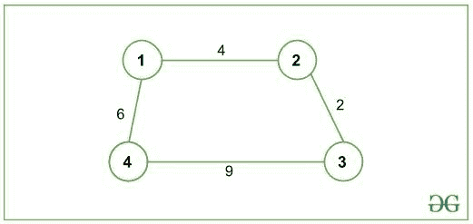
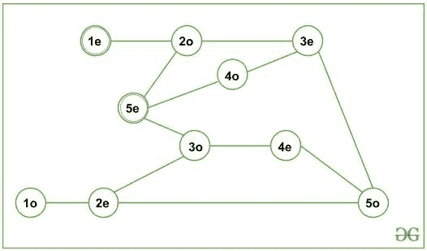

# 从源到目标的边缘数为偶数的最短路径

> 原文： [https://www.geeksforgeeks.org/shortest-path-with-even-number-of-edges-from-source-to-destination/](https://www.geeksforgeeks.org/shortest-path-with-even-number-of-edges-from-source-to-destination/)

给定无向图 **G** ，任务是找到偶数长度的最短路径，其中 **1** 作为源节点， **N** 作为目标节点。 路径长度是指路径中存在的边数（而不是路径成本）。

**示例：**

> **输入：** N = 5，下面给出 G：
> 
> **输出：** 10
> **说明：**
> 全部 从 1（源节点）到 5（目标节点）的路径为：
> 1- > 2- > 5
> 成本：16 长度：2（偶数）
> 1- > 2 -> 3- > 5
> 费用：4 长度：3（奇数）
> 1- > 2- > 3- > 4- > 5
> 费用 ：10 长度：4（偶数）
> 最短路径是 1- > 2- > 3- > 5，总成本为 4，但它的路径长为奇数，因为我们感兴趣 仅偶数路径，具有偶数长度的最短路径是 1- > 2- > 3- > 4- > 5，总成本为 10。
> 
> **输入 2：** N = 4，G 给出如下：
> 
> **输出：** -1
> 
> **说明：**
> 从 1（源节点）到 4（目标节点）没有偶数长度的路径。

**方法：**
创建一个新图形（ **G’**）。 对于初始图 **G** 中的每个节点 **V** ，创建两个新节点 **V_even** 和 **V_odd** 。

> 此处， **V_odd** 将表示为（（V * 10）+ 1）， **V_even** 将表示为（（V * 10）+ 2）。
> 例如，如果节点 **V** = 4，则 **V_odd** = 41， **V_even** = 42。

现在，对于 **G** 中的每个边（ **U，V** ），在 **G'**，**（U_even，V_odd）**中添加两个新边 和**（U_odd，V_even）**。 最后，使用 [Dijkstra 最短路径算法](https://www.geeksforgeeks.org/dijkstras-shortest-path-algorithm-greedy-algo-7/)找到从**（source_even）**节点到**（destination_even）**节点的最短路径。

对于输入 1（以上）中给出的图， **G'**可以表示为：

从图 **G'**可以看出 从**（1_even）**到**（5_even）**的偶数长度路径。 因此，奇数长度的路径在 **G’**中分离，并且可以获得所需的最短路径。

下面是上述方法的实现：

```

// C++ program for the above approach 
#include <bits/stdc++.h> 
using namespace std; 

const int MAXX = 10000, INF = 1e9; 

// Adjacency List: to represent graph 
vector<vector<pair<int, int> > > 
    adj(MAXX * 10 + 3); 

// Distance Array: to store shortest 
// distance to every node 
vector<int> dist(MAXX * 10 + 3, INF); 

// returns value which will 
// represent even_x 
int even(int x) 
{ 
    return x * 10 + 2; 
} 
// returns value which will 
// represent odd_x 
int odd(int x) 
{ 
    return x * 10 + 1; 
} 

// converting edge (a->b) to 2 
// different edges i.e. (a->b) 
// converts to (1). even_a -> odd_b 
// (2). odd_a -> even_b 
// since, graph is undirected, so we 
// push them in reverse order too 
// hence, 4 push_back operations are 
// there. 
void addEdge(int a, int b, int cost) 
{ 
    adj[even(a)].push_back( 
        { odd(b), cost }); 
    adj[odd(a)].push_back( 
        { even(b), cost }); 
    adj[odd(b)].push_back( 
        { even(a), cost }); 
    adj[even(b)].push_back( 
        { odd(a), cost }); 
} 

// Function calculates shortest 
// distance to all nodes from 
// "source" using Dijkstra 
// Shortest Path Algorithm 
// and returns shortest distance 
// to "destination" 
int dijkstra(int source, 
             int destination) 
{ 

    /* Priority Queue/min-heap  
    to store and process 
    (distance, node) */
    priority_queue<pair<int, int>, 
                   vector<pair<int, int> >, 
                   greater<pair<int, int> > > 
        pq; 

    // pushing source node to 
    // priority queue and dist from 
    // source to source is set to 0 
    pq.push({ 0, even(source) }); 
    dist[even(source)] = 0; 

    while (!pq.empty()) { 

        // U is the node at top 
        // of the priority queue 
        // note that pq.top().first 
        // refers to the Distance 
        // and pq.top().second 
        // will refer to the Node 
        int u = pq.top().second; 
        pq.pop(); 

        // exploring all neighbours 
        // of node u 
        for (pair<int, int> p : 
             adj[u]) { 

            /* v is neighbour node of u  
          and c is the cost/weight 
          of edge (u, v) */
            int v = p.first; 
            int c = p.second; 

            // relaxation: checking if there 
            // is a shorter path to v via u 
            if (dist[u] + c 
                < dist[v]) { 

                // updating distance of v 
                dist[v] = dist[u] + c; 
                pq.push({ dist[v], v }); 
            } 
        } 
    } 

    // returning shortest 
    // distance to "destination" 
    return dist[even(destination)]; 
} 

// Driver function 
int main() 
{ 
    // n = number of Nodes, 
    // m = number of Edges 
    int n = 5, m = 6; 
    addEdge(1, 2, 1); 
    addEdge(2, 3, 2); 
    addEdge(2, 5, 15); 
    addEdge(3, 5, 1); 
    addEdge(3, 4, 4); 
    addEdge(5, 4, 3); 

    int source = 1; 
    int destination = n; 
    int ans = dijkstra(source, destination); 

    // if ans is INF: There is no 
    // even length path from source 
    // to destination else path 
    // exists and we print the 
    // shortest distance 
    if (ans == INF) 
        cout << "-1"
             << "\n"; 
    else
        cout << ans << "\n"; 

    return 0; 
} 

```

**Output:**

```
10

```

***时间复杂度：**（E * log（V））*

[](https://practice.geeksforgeeks.org/courses/competitive-programming-live?utm_source=geeksforgeeks&utm_medium=article&utm_campaign=gfg_article_cp)

* * *

* * *

如果您喜欢 GeeksforGeeks 并希望做出贡献，则还可以使用 [tribution.geeksforgeeks.org](https://contribute.geeksforgeeks.org/) 撰写文章，或将您的文章邮寄至 tribution@geeksforgeeks.org。 查看您的文章出现在 GeeksforGeeks 主页上，并帮助其他 Geeks。

如果您发现任何不正确的地方，请单击下面的“改进文章”按钮，以改进本文。