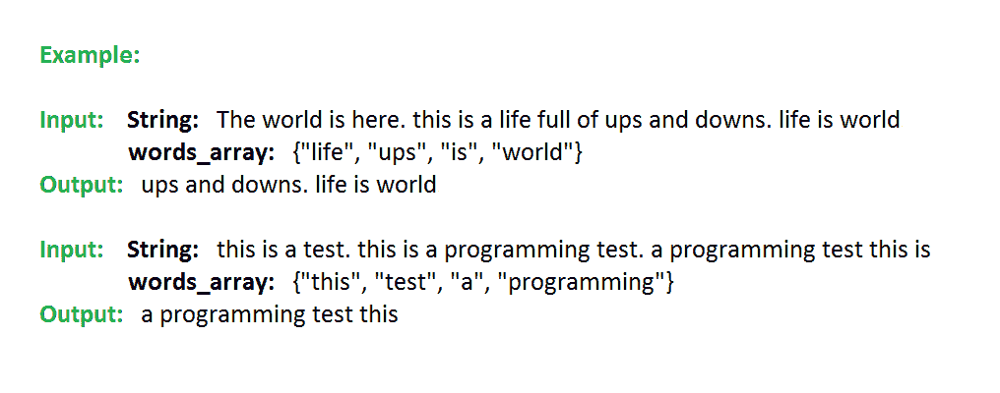

# 包含所有给定单词的字符串的最短子字符串

> 原文：[https://www.geeksforgeeks.org/shortest-substring-string-containing-given-words/](https://www.geeksforgeeks.org/shortest-substring-string-containing-given-words/)

打印包含所有给定单词的字符串的最短子字符串。



在第一个示例中，可能有两种解决方案：“世界在这里。 这是充满起伏和起伏的生活。 生活就是世界”。

1.  使用要求搜索的所有给定单词初始化`HashMap`并将其值分配为 -1。

2.  维持柜台。

3.  逐字遍历整个字符串，然后对每个句子单词进行遍历

    *   如果句子中的单词已存在，请更新该单词的最后位置。

    *   如果未初始化更新的最后位置，则增加总数。

    *   如果总计数等于所有给定单词的计数，则循环遍历最后一个位置并找到最小的一个。 当前位置和该值之间的距离将是子字符串的长度。 记录这些值并找到所有位置上的最佳值

以下是上述步骤的 Java 实现。

```
// Java program to find the shortest substring of a
// string containing all given words using HashMap
import java.io.*;
import java.util.*;
import java.util.HashMap;
class Shortest {
public static void findShortest(String sentence,
String[] words)
{
// Make an array of words from given sentence
// We remove punctuations before splitting.
String replicate = sentence.replace( "." , "" );
replicate = replicate.replace( ", " , "" );
replicate = replicate.replace( "!" , "" );
String sent_words[] = replicate.split( " " );
[
// hashmap to store given words in a map.
HashMap<String, Integer> map = new HashMap<>();
int length = words.length;
for ( int i = 0 ; i < length; i++)
map.put(words[i], - 1 );
// Traverse through all sentence words
// and if they match with given words
// then mark their appearances in map.
int len_sub = Integer.MAX_VALUE;
int count = 0 ;
int local_start = 0 , local_end = 0 ;
for ( int i = 0 ; i < sent_words.length; i++) {
if (map.containsKey(sent_words[i]) == true ) {
// If this is the first occurrence
int index = map.get(sent_words[i]);
if (index == - 1 )
count++;
[
// Store latest index
map.put(sent_words[i], i);
HTG306] [H TG307]                  // If all words matched
if (count == length) {
// Find smallest index
int min = Integer.MAX_VALUE;
for (Map.Entry<String, Integer> m :
map.entrySet()) {
int val = m.getValue();
if (val < min)
min = val;
}
的
// Check if current length is smaller
// then length so far
int s = i - min;
if (s < len_sub) {
local_start = min;
local_end = i;
len_sub=s;
}
}
}
}
// Printing original substring (with punctuations)
// using resultant local_start and local_end.
String[] original_parts = sentence.split( " " );
for ( int i = local_start; i <=local_end; i++)
System.out.print(original_parts[i] + " " );
}
// Driver code
public static void main(String args[])
{
String sentence = "The world is here. this is a" +
" life full of ups and downs. life is world." ;
String[] words = { "life" , "ups" , "is" , "world" };
findShortest(sentence, words);
}
[
}
```

输出：

```
ups and downs. life is 
```

本文由 [**Shifa Khan**](https://auth.geeksforgeeks.org/profile.php?user=Apple0710) 贡献。 如果您喜欢 GeeksforGeeks 并希望做出贡献，则还可以使用 [tribution.geeksforgeeks.org](http://www.contribute.geeksforgeeks.org) 撰写文章，或将您的文章邮寄至 tribution@geeksforgeeks.org。 查看您的文章出现在 GeeksforGeeks 主页上，并帮助其他 Geeks。

如果发现任何不正确的地方，或者想分享有关上述主题的更多信息，请写评论。

