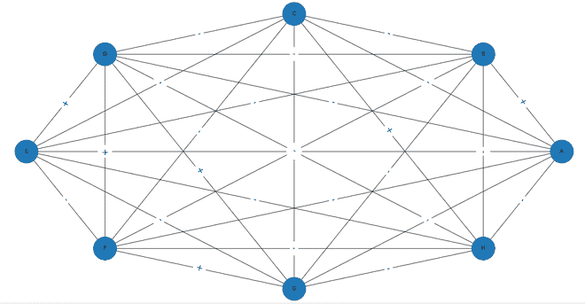
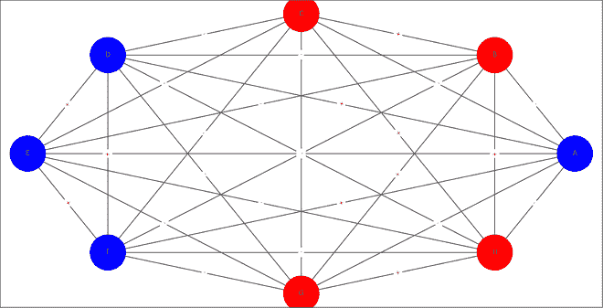

# 社交网络中的签名网络

> 原文： [https://www.geeksforgeeks.org/signed-networks-in-social-networks/](https://www.geeksforgeeks.org/signed-networks-in-social-networks/)

**先决条件**：[社交网络简介](https://www.geeksforgeeks.org/introduction-to-social-networks-using-networkx-in-python/)

在社交网络中，网络有 2 种类型-未签名网络和已签名网络。 在未签名的网络中，任何节点之间都没有符号，而在签名的网络中，+或-的两个节点之间始终都存在一个符号。 “ +”号表示 2 个节点之间的友谊，“-”号表示 2 个节点之间的敌意。

我们的任务是使用 python 语言在 N 个节点上创建一个签名网络。

**方法**：

1.  创建图并向其添加节点。
2.  添加所有可能的边并为其分配一个符号。
3.  获取网络中所有可能的三角形的列表。
4.  将所有三角形的符号详细信息存储在网络中。
5.  计算网络中不稳定三角形的总数
6.  现在，从列表中选择一个不稳定的三角形并使它稳定。
7.  再次计算多个不稳定三角形。
8.  重复步骤 6 和 7，直到没有不稳定的三角形。
9.  现在形成一个联盟（联盟 1 中的朋友节点为红色，而其他联盟中的敌人节点为蓝色）并显示图形。

下面是实现。

## Python

```py

import networkx as nx 
import matplotlib.pyplot as plt 
import random 
import itertools 

def get_signs_of_graph(g, tris_list): 

    # eg-['A-B','B-C','C-A'] 
    all_signs = [] 

    for i in range(len(tris_list)): 
        t = [] 
        t.append(g[tris_list[i][0]][tris_list[i][1]]['sign']) 
        t.append(g[tris_list[i][1]][tris_list[i][2]]['sign']) 
        t.append(g[tris_list[i][2]][tris_list[i][0]]['sign']) 
        all_signs.append(t) 
    return all_signs 

def unstablecount(all_signs): 
    stable = 0
    unstable = 0

    for i in range(len(all_signs)): 
        if (((all_signs[i]).count('+')) == 1 or ((all_signs[i]).count('+')) == 3): 
            stable += 1
    unstable = len(all_signs) - stable 
    return unstable 

def move_graph_to_stable(g, tris_list, all_signs): 
    found_unstable = False
    ran = 0

    while (found_unstable == False): 
        ran = random.randint(0, len(tris_list) - 1) 
        if (all_signs[ran].count('+') % 2 == 0): 
            found_unstable = True
        else: 
            continue

    r = random.randint(1, 3) 

    if (all_signs[ran].count('+') == 2): 

        if (r == 1): 
            if (g[tris_list[ran][0]][tris_list[ran][1]]['sign'] == '+'): 
                g[tris_list[ran][0]][tris_list[ran][1]]['sign'] = '-'
            else: 
                g[tris_list[ran][0]][tris_list[ran][1]]['sign'] = '+'

        elif (r == 2): 
            if (g[tris_list[ran][1]][tris_list[ran][2]]['sign'] == '+'): 
                g[tris_list[ran][1]][tris_list[ran][2]]['sign'] = '-'
            else: 
                g[tris_list[ran][1]][tris_list[ran][2]]['sign'] = '+'

        else: 
            if (g[tris_list[ran][0]][tris_list[ran][2]]['sign'] == '+'): 
                g[tris_list[ran][0]][tris_list[ran][2]]['sign'] = '-'
            else: 
                g[tris_list[ran][0]][tris_list[ran][2]]['sign'] = '+'

    else: 

        if (r == 1): 
            g[tris_list[ran][0]][tris_list[ran][1]]['sign'] = '+'

        elif (r == 2): 
            g[tris_list[ran][1]][tris_list[ran][2]]['sign'] = '+'

        else: 
            g[tris_list[ran][0]][tris_list[ran][2]]['sign'] = '+'

    return g 

def Coalition(g): 

    f = [] 
    s = [] 
    nodes = g.nodes() 
    r = random.choice(list(nodes)) 

    f.append(r) 
    processed_nodes = [] 
    to_be_processed = [r] 

    for each in to_be_processed: 
        if each not in processed_nodes: 
            neigh = list(g.neighbors(each)) 
            for i in range(len(neigh)): 
                if (g[each][neigh[i]]['sign'] == '+'): 
                    if (neigh[i] not in f): 
                        f.append(neigh[i]) 
                    if (neigh[i] not in to_be_processed): 
                        to_be_processed.append(neigh[i]) 
                elif (g[each][neigh[i]]['sign'] == '-'): 
                    if (neigh[i] not in s): 
                        s.append(neigh[i]) 
                        processed_nodes.append(neigh[i]) 

            processed_nodes.append(each) 

    return f, s 

# 1.Create graph 
g = nx.Graph() 
n = 8
g.add_nodes_from(range(1, n + 1)) 
map = {1: "A", 2: "B", 3: "C", 4: "D", 5: "E", 
       6: "F", 7: "G", 8: "H", 9: "I", 10: "J"} 
signs = ['+', '-'] 
g = nx.relabel_nodes(g, map) 

# 2.Add every possible edge and assign sign 
for i in g.nodes(): 
    for j in g.nodes(): 
        if (i != j): 
            g.add_edge(i, j, sign=random.choice(signs)) 

# 3.Display graph 
edge_attributes = nx.get_edge_attributes(g, 'sign') 
pos = nx.circular_layout(g) 
nx.draw(g, pos, node_size=3000, with_labels=1) 
nx.draw_networkx_edge_labels( 
    g, pos, edge_labels=edge_attributes, font_size=20, font_color='blue') 
plt.show() 

# 4.1.Get list of all the triangles in network 
nodes = g.nodes() 
tris_list = [list(x) for x in itertools.combinations(nodes, 3)] 

# 4.2.Store the sign details of all the triangles 
all_signs = get_signs_of_graph(g, tris_list) 

# 4.3.Count total number of unstable triangle 
# in the network 
unstable = unstablecount(all_signs) 

# 5 chose the triangle in the graph that is unstable 
# and make the triangle stable 
unstable_track = [unstable] 

while (unstable != 0): 
    g = move_graph_to_stable(g, tris_list, all_signs) 
    all_signs = get_signs_of_graph(g, tris_list) 
    unstable = unstablecount(all_signs) 
    unstable_track.append(unstable) 

# 6 Form the coalition 
first, second = Coalition(g) 
print(first) 
print(second) 

edge_labels = nx.get_edge_attributes(g, 'sign') 
pos = nx.circular_layout(g) 

nx.draw_networkx_nodes(g, pos, nodelist=first, 
                       node_color='red', node_size=4000) 
nx.draw_networkx_nodes(g, pos, nodelist=second, 
                       node_color='blue', node_size=4000) 
nx.draw_networkx_labels(g, pos) 
nx.draw_networkx_edges(g, pos) 
nx.draw_networkx_edge_labels(g, pos, edge_labels=edge_labels, font_color="red") 
plt.show() 

```

**输出**：

```
['G', 'B', 'C', 'H']
['A', 'D', 'E', 'F']

```



没有联盟的初始签署网络



与联盟最终签署的网络

注意怪胎！ 通过 [**Python 编程基础**](https://practice.geeksforgeeks.org/courses/Python-Foundation?utm_source=geeksforgeeks&utm_medium=article&utm_campaign=GFG_Article_Bottom_Python_Foundation) 课程加强基础，并学习基础知识。

首先，您的面试准备将通过 [**Python DS**](https://practice.geeksforgeeks.org/courses/Data-Structures-With-Python?utm_source=geeksforgeeks&utm_medium=article&utm_campaign=GFG_Article_Bottom_Python_DS) 课程来增强您的数据结构概念。

* * *

* * *

如果您喜欢 GeeksforGeeks 并希望做出贡献，则还可以使用 [tribution.geeksforgeeks.org](https://contribute.geeksforgeeks.org/) 撰写文章，或将您的文章邮寄至 tribution@geeksforgeeks.org。 查看您的文章出现在 GeeksforGeeks 主页上，并帮助其他 Geeks。

如果您发现任何不正确的地方，请单击下面的“改进文章”按钮，以改进本文。