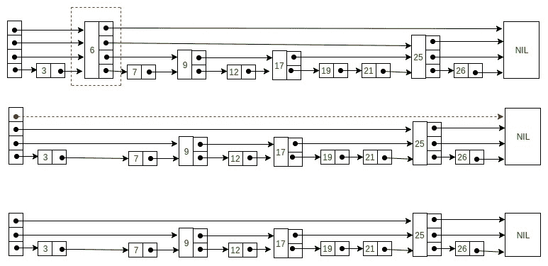

# 跳过列表| 第3组（搜索和删除）

在上一篇文章[中，跳过列表| 第2组（插入）](https://www.geeksforgeeks.org/skip-list-set-2-insertion/)我们讨论了跳过节点的结构以及如何在跳过列表中插入元素。 在本文中，我们将讨论如何在跳过列表中搜索和删除元素。

**在跳过列表**中搜索元素

搜索元素与搜索要在跳过列表中插入元素的地点的方法非常相似。 基本想法是-

1.  下一个节点的关键字小于搜索关键字，然后我们继续在相同级别上前进。
2.  下一个节点的密钥大于要插入的密钥，然后在 **update [i]** 处存储指向当前节点 **i** 的指针，然后向下移动一级并继续搜索。

在最低级别（0），如果最右边元素（update [0]）旁边的元素的键等于搜索键，则我们发现该键否则失败。
以下是用于搜索元素的伪代码–

```
Search(list, searchKey)
x := list -> header
-- loop invariant: x -> key  level downto 0 do
    while x -> forward[i] -> key  forward[i]
x := x -> forward[0]
if x -> key = searchKey then return x -> value
else return failure

```

考虑这个示例，我们要在其中搜索键17-


**从跳过列表中删除元素**

在删除元素k之前，使用上述搜索算法在跳过列表中定位元素。 定位元素后，就像我们在单链列表中一样，完成了指针的重新排列以删除元素表单列表。 我们从最低级别开始进行重新排列，直到update [i]旁边的元素不是k。

删除元素后，可能会存在没有元素的级别，因此我们也将通过减少“跳过”列表的级别来删除这些级别。 以下是删除的伪代码–

```
Delete(list, searchKey)
local update[0..MaxLevel+1]
x := list -> header
for i := list -> level downto 0 do
    while x -> forward[i] -> key  forward[i]
    update[i] := x
x := x -> forward[0]
if x -> key = searchKey then
    for i := 0 to list -> level do
        if update[i] -> forward[i] ≠ x then break
        update[i] -> forward[i] := x -> forward[i]
    free(x)
    while list -> level > 0 and list -> header -> forward[list -> level] = NIL do
        list -> level := list -> level – 1

```

考虑这个示例，我们要删除元素6 –


在第3层，删除元素6后没有元素（红色箭头）。因此，我们将跳过列表的层数减1。

以下是用于从跳过列表中搜索和删除元素的代码–

## C ++

*filter_none*

*编辑*
*关闭*

*play_arrow*

*链接*
*亮度_4*
*代码*

| `// C++ code for searching and deleting element in skip list``#include <bits/stdc++.h>``using` `namespace` `std;``// Class to implement node``class` `Node``{``public``:``int` `key;``// Array to hold pointers to node of different level ``Node **forward;``Node(``int``,` `int``);``};``Node::Node(``int` `key,` `int` `level)``{``this``->key = key;``// Allocate memory to forward ``forward =` `new` `Node*[level+1];``// Fill forward array with 0(NULL)``memset``(forward, 0,` `sizeof``(Node*)*(level+1));``};``// Class for Skip list``class` `SkipList``{``// Maximum level for this skip list``int` `MAXLVL;``// P is the fraction of the nodes with level ``// i pointers also having level i+1 pointers``float` `P;``// current level of skip list``int` `level;``// pointer to header node``Node *header;``public``:``SkipList(``int``,` `float``);``int` `randomLevel();``Node* createNode(``int``,` `int``);``void` `insertElement(``int``);``void` `deleteElement(``int``);``void` `searchElement(``int``);``void` `displayList();``};``SkipList::SkipList(``int` `MAXLVL,` `float` `P)``{``this``->MAXLVL = MAXLVL;``this``->P = P;``level = 0;``// create header node and initialize key to -1``header =` `new` `Node(-1, MAXLVL);``};``// create random level for node``int` `SkipList::randomLevel()``{``float` `r = (``float``)``rand``()/RAND_MAX;``int` `lvl = 0;``while``(r < P && lvl < MAXLVL)``{``lvl++;``r = (``float``)``rand``()/RAND_MAX;``}``return` `lvl;``};``// create new node``Node* SkipList::createNode(``int` `key,` `int` `level)``{``Node *n =` `new` `Node(key, level);``return` `n;``};``// Insert given key in skip list``void` `SkipList::insertElement(``int` `key)``{``Node *current = header;``// create update array and initialize it``Node *update[MAXLVL+1];``memset``(update, 0,` `sizeof``(Node*)*(MAXLVL+1));``/*    start from highest level of skip list``move the current pointer forward while key ``is greater than key of node next to current``Otherwise inserted current in update and ``move one level down and continue search``*/``for``(``int` `i = level; i >= 0; i--)``{``while``(current->forward[i] != NULL &&``current->forward[i]->key < key)``current = current->forward[i];``update[i] = current;``}``/* reached level 0 and forward pointer to ``right, which is desired position to ``insert key. ``*/``current = current->forward[0];``/* if current is NULL that means we have reached``to end of the level or current's key is not equal``to key to insert that means we have to insert``node between update[0] and current node */``if` `(current == NULL &#124;&#124; current->key != key)``{``// Generate a random level for node``int` `rlevel = randomLevel();``/* If random level is greater than list's current``level (node with highest level inserted in ``list so far), initialize update value with pointer``to header for further use */``if``(rlevel > level)``{``for``(``int` `i=level+1;i<rlevel+1;i++)``update[i] = header;``// Update the list current level``level = rlevel;``}``// create new node with random level generated``Node* n = createNode(key, rlevel);``// insert node by rearranging pointers ``for``(``int` `i=0;i<=rlevel;i++)``{``n->forward[i] = update[i]->forward[i];``update[i]->forward[i] = n;``}``cout<<``"Successfully Inserted key "``<<key<<``"\n"``;``}``};``// Delete element from skip list``void` `SkipList::deleteElement(``int` `key)``{``Node *current = header;``// create update array and initialize it``Node *update[MAXLVL+1];``memset``(update, 0,` `sizeof``(Node*)*(MAXLVL+1));``/*    start from highest level of skip list``move the current pointer forward while key ``is greater than key of node next to current``Otherwise inserted current in update and ``move one level down and continue search``*/``for``(``int` `i = level; i >= 0; i--)``{``while``(current->forward[i] != NULL  &&``current->forward[i]->key < key)``current = current->forward[i];``update[i] = current;``}``/* reached level 0 and forward pointer to ``right, which is possibly our desired node.*/``current = current->forward[0];``// If current node is target node``if``(current != NULL and current->key == key)``{``/* start from lowest level and rearrange``pointers just like we do in singly linked list``to remove target node */``for``(``int` `i=0;i<=level;i++)``{``/* If at level i, next node is not target ``node, break the loop, no need to move ``further level */``if``(update[i]->forward[i] != current)``break``;``update[i]->forward[i] = current->forward[i];``}``// Remove levels having no elements ``while``(level>0 &&``header->forward[level] == 0)``level--;``cout<<``"Successfully deleted key "``<<key<<``"\n"``;``}``};``// Search for element in skip list``void` `SkipList::searchElement(``int` `key)``{``Node *current = header;``/*    start from highest level of skip list``move the current pointer forward while key ``is greater than key of node next to current``Otherwise inserted current in update and ``move one level down and continue search``*/``for``(``int` `i = level; i >= 0; i--)``{``while``(current->forward[i] &&``current->forward[i]->key < key)``current = current->forward[i];``}``/* reached level 0 and advance pointer to ``right, which is possibly our desired node*/``current = current->forward[0];``// If current node have key equal to``// search key, we have found our target node``if``(current and current->key == key) ``cout<<``"Found key: "``<<key<<``"\n"``;``};``// Display skip list level wise``void` `SkipList::displayList()``{``cout<<``"\n*****Skip List*****"``<<``"\n"``;``for``(``int` `i=0;i<=level;i++)``{``Node *node = header->forward[i];``cout<<``"Level "``<<i<<``": "``;``while``(node != NULL)``{``cout<<node->key<<``" "``;``node = node->forward[i];``}``cout<<``"\n"``;``}``};``// Driver to test above code``int` `main()``{``// Seed random number generator``srand``((unsigned)``time``(0));``// create SkipList object with MAXLVL and P ``SkipList lst(3, 0.5);``lst.insertElement(3);``lst.insertElement(6);``lst.insertElement(7);``lst.insertElement(9);``lst.insertElement(12);``lst.insertElement(19);``lst.insertElement(17);``lst.insertElement(26);``lst.insertElement(21);``lst.insertElement(25);``lst.displayList();``//Search for node 19``lst.searchElement(19);``//Delete node 19``lst.deleteElement(19);``lst.displayList();``}` |

*chevron_right**filter_none*