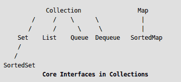

# 按频率对元素进行排序 | 系列 5（使用 Java `Map`）

> 原文：[https://www.geeksforgeeks.org/sort-elements-by-frequency-set-5-using-java-map/](https://www.geeksforgeeks.org/sort-elements-by-frequency-set-5-using-java-map/)

给定一个整数数组，请按照元素的降序对数组进行排序，如果两个元素的频率相同，则按升序进行排序

**示例**：

```
Input: arr[] = {2, 3, 2, 4, 5, 12, 2, 3, 3, 3, 12}
Output: 3 3 3 3 2 2 2 12 12 4 5
Explanation :
No. Freq
2  : 3
3  : 4
4  : 1
5  : 1
12 : 2

Input: arr[] = {4, 4, 2, 2, 2, 2, 3, 3, 1, 1, 6, 7, 5}
Output: 2 2 2 2 1 1 3 3 4 4 5 6 7

```

以下帖子中讨论了不同的方法：

[按频率对元素进行排序 | 系列 1](https://www.geeksforgeeks.org/sort-elements-by-frequency/)

[按频率对元素进行排序| Set 2](https://www.geeksforgeeks.org/sort-elements-by-frequency-set-2/)

[按频率对数组元素进行排序 | 系列 3（使用 STL）](https://www.geeksforgeeks.org/sorting-array-elements-frequency-set-3-using-stl/)

[按频率对元素进行排序 | 系列 4（使用哈希的有效方法）](https://www.geeksforgeeks.org/sort-elements-frequency-set-4-efficient-approach-using-hash/)

**方法**：

此集合中已使用 [Java `Map`](https://www.geeksforgeeks.org/map-interface-java-examples/)解决了该问题。 [`java.util.Map`](https://www.geeksforgeeks.org/map-interface-java-examples/) 接口表示键和值之间的映射。 `Map`接口不是`Collection`接口的子类型。 因此，它的行为与其余集合类型略有不同。



**在以下程序中**：

*   在映射中获取元素及其计数

*   通过使用比较器接口，比较给定列表中元素的频率。

*   使用此比较器可以通过实现 [Collections.sort（）](https://www.geeksforgeeks.org/collections-sort-java-examples/)方法对列表进行排序。

*   打印排序列表。

**程序**：

```
import java.util.*;
public class GFG {
]      // Driver Code
public static void main(String[] args)
{
的
// Declare and Initialize an array
int [] array = { 4 , 4 , 2 , 2 , 2 , 2 , 3 , 3 , 1 , 1 , 6 , 7 , 5 };
Map<Integer, Integer> map = new HashMap<>();
List<Integer> outputArray = new ArrayList<>();
// Assign elements and their count in the list and map
for ( int current : array) {
int count = map.getOrDefault(current, 0 ); [HTG20 5]
map.put(current, count + 1 );
outputArray.add(current);
}
// Compare the map by value
SortComparator comp = new SortComparator(map);
// Sort the map using Collections CLass ]
Collections.sort(outputArray, comp);
// Final Output
for (Integer i : outputArray) {
System.out.print(i + " " );
}
}
}
// Implement Comparator Interface to sort the values
class SortComparator implements Comparator<Integer> {
private final Map<Integer, Integer> freqMap;
// Assign the specified map
SortComparator(Map<Integer, Integer> tFreqMap)
{
this .freqMap = tFreqMap;
}
// Compare the values
@Override
public int compare(Integer k1, Integer k2)
{
]
// Compare value by frequency
int freqCompare = freqMap.get(k2).compareTo(freqMap.get(k1));
// Compare value if frequency is equal
int valueCompare = k1.compareTo(k2);
// If frequency is equal, then just compare by value, otherwise -
// compare by the frequency.
if (freqCompare == 0 )
return valueCompare;
else
return freqCompare;
}
}
```

**Output:**

```
2 2 2 2 1 1 3 3 4 4 5 6 7

```

> 时间复杂度：`O(n Log n)`


* * *

* * *


