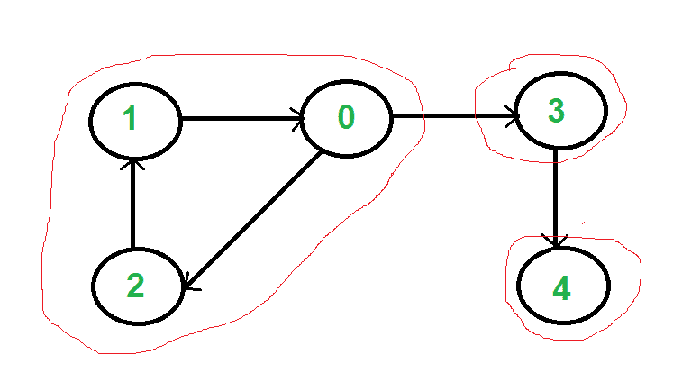

# 牢固连接的组件

> 原文： [https://www.geeksforgeeks.org/strongly-connected-components/](https://www.geeksforgeeks.org/strongly-connected-components/)

如果所有对顶点之间都有路径，则有向图是牢固连接的。 有向图的强连接组件（ **SCC** ）是最大的强连接子图。 例如，下图中有 3 个 SCC。



我们可以使用 [Kosaraju 的算法](http://en.wikipedia.org/wiki/Kosaraju%27s_algorithm)在 O（V + E）时间内找到所有强连通的组件。 以下是详细的 Kosaraju 的算法。

1.  创建一个空堆栈'S'，并进行图的 DFS 遍历。 在 DFS 遍历中，在为顶点的相邻顶点调用递归 DFS 之后，将顶点推入堆栈。 在上图中，如果从顶点 0 开始 DFS，则堆栈中的顶点分别为 1，2，4，3，0。

2.  所有圆弧的反向以获得转置图 。

3.  当 S 不为空时，从 S 逐一弹出顶点。 让弹出的顶点为“ v”。 将 v 作为源并执行 DFS（调用 [DFSUtil（v）](https://www.geeksforgeeks.org/depth-first-traversal-for-a-graph/)）。 从 v 开始的 DFS 会打印 v 的强连接部分。在上面的示例中，我们以 0、3、4、2、1（从堆栈中弹出的一个）顺序处理顶点。

**这是如何工作的？**

上面的算法基于 DFS。 它执行 DFS 两次。 如果从 DFS 起点可以到达所有顶点，则图的 DFS 会生成一棵树。 否则，DFS 会生成林。 因此，只有一个 SCC 的图的 DFS 总是产生一棵树。 需要注意的重要一点是，根据选择的起点，当存在多个 SCC 时，DFS 可能会产生树木或森林。 例如，在上图中，如果我们从顶点 0 或 1 或 2 开始 DFS，我们将得到一棵树作为输出。 如果我们从 3 或 4 开始，就会有一片森林。 要查找并打印所有 SCC，我们希望从顶点 4（这是一个汇聚顶点）开始 DFS，然后移到 3（在其余集合（不包括 4 的集合中））中汇聚，最后移到其余任何一个顶点（0， 1、2）。 那么，我们如何找到这个选择顶点的序列作为 DFS 的起点呢？ 不幸的是，没有直接的方法来获得这个序列。 但是，如果我们对图形进行 DFS 处理并根据顶点的完成时间存储顶点，请确保连接到其他 SCC（除了其自己的 SCC）的顶点的完成时间始终大于顶点的完成时间。 在另一个 SCC 中（有关证据，请参见[此](http://www.personal.kent.edu/~rmuhamma/Algorithms/MyAlgorithms/GraphAlgor/strongComponent.htm)）。 例如，在上述示例图的 DFS 中，结束时间 0 始终大于 3 和 4（与 DFS 考虑的顶点顺序无关）。 而且 3 的完成时间总是大于 4。DFS 不能保证其他顶点，例如 1 和 2 的完成时间可能小于或大于 3 和 4，具体取决于 DFS 考虑的顶点顺序。 因此，要使用此属性，我们需要对完整图形进行 DFS 遍历，并将每个完成的顶点推入堆栈。 在堆栈中，3 总是出现在 4 之后，而 0 总是出现在 3 和 4 之后。

在下一步中，我们反转图形。 考虑 SCC 的图。 在反向图中，连接两个组件的边被反向。 因此，SCC {0，1，2}变为接收器，而 SCC {4}变为源。 如上所述，在堆栈中，我们总是在 3 和 4 之前有 0。因此，如果使用堆栈中的顶点序列对反向图进行 DFS，则将处理从接收器到源的顶点（在反向图中）。 这就是我们想要实现的目标，而这是一张一张打印 SCC 所需要的。


以下是 Kosaraju 算法的 C++实现。

## C++

```cpp

// C++ Implementation of Kosaraju's algorithm to print all SCCs 
#include <iostream> 
#include <list> 
#include <stack> 
using namespace std; 

class Graph 
{ 
    int V;    // No. of vertices 
    list<int> *adj;    // An array of adjacency lists 

    // Fills Stack with vertices (in increasing order of finishing 
    // times). The top element of stack has the maximum finishing  
    // time 
    void fillOrder(int v, bool visited[], stack<int> &Stack); 

    // A recursive function to print DFS starting from v 
    void DFSUtil(int v, bool visited[]); 
public: 
    Graph(int V); 
    void addEdge(int v, int w); 

    // The main function that finds and prints strongly connected 
    // components 
    void printSCCs(); 

    // Function that returns reverse (or transpose) of this graph 
    Graph getTranspose(); 
}; 

Graph::Graph(int V) 
{ 
    this->V = V; 
    adj = new list<int>[V]; 
} 

// A recursive function to print DFS starting from v 
void Graph::DFSUtil(int v, bool visited[]) 
{ 
    // Mark the current node as visited and print it 
    visited[v] = true; 
    cout << v << " "; 

    // Recur for all the vertices adjacent to this vertex 
    list<int>::iterator i; 
    for (i = adj[v].begin(); i != adj[v].end(); ++i) 
        if (!visited[*i]) 
            DFSUtil(*i, visited); 
} 

Graph Graph::getTranspose() 
{ 
    Graph g(V); 
    for (int v = 0; v < V; v++) 
    { 
        // Recur for all the vertices adjacent to this vertex 
        list<int>::iterator i; 
        for(i = adj[v].begin(); i != adj[v].end(); ++i) 
        { 
            g.adj[*i].push_back(v); 
        } 
    } 
    return g; 
} 

void Graph::addEdge(int v, int w) 
{ 
    adj[v].push_back(w); // Add w to v’s list. 
} 

void Graph::fillOrder(int v, bool visited[], stack<int> &Stack) 
{ 
    // Mark the current node as visited and print it 
    visited[v] = true; 

    // Recur for all the vertices adjacent to this vertex 
    list<int>::iterator i; 
    for(i = adj[v].begin(); i != adj[v].end(); ++i) 
        if(!visited[*i]) 
            fillOrder(*i, visited, Stack); 

    // All vertices reachable from v are processed by now, push v  
    Stack.push(v); 
} 

// The main function that finds and prints all strongly connected  
// components 
void Graph::printSCCs() 
{ 
    stack<int> Stack; 

    // Mark all the vertices as not visited (For first DFS) 
    bool *visited = new bool[V]; 
    for(int i = 0; i < V; i++) 
        visited[i] = false; 

    // Fill vertices in stack according to their finishing times 
    for(int i = 0; i < V; i++) 
        if(visited[i] == false) 
            fillOrder(i, visited, Stack); 

    // Create a reversed graph 
    Graph gr = getTranspose(); 

    // Mark all the vertices as not visited (For second DFS) 
    for(int i = 0; i < V; i++) 
        visited[i] = false; 

    // Now process all vertices in order defined by Stack 
    while (Stack.empty() == false) 
    { 
        // Pop a vertex from stack 
        int v = Stack.top(); 
        Stack.pop(); 

        // Print Strongly connected component of the popped vertex 
        if (visited[v] == false) 
        { 
            gr.DFSUtil(v, visited); 
            cout << endl; 
        } 
    } 
} 

// Driver program to test above functions 
int main() 
{ 
    // Create a graph given in the above diagram 
    Graph g(5); 
    g.addEdge(1, 0); 
    g.addEdge(0, 2); 
    g.addEdge(2, 1); 
    g.addEdge(0, 3); 
    g.addEdge(3, 4); 

    cout << "Following are strongly connected components in "
            "given graph \n"; 
    g.printSCCs(); 

    return 0; 
} 

```