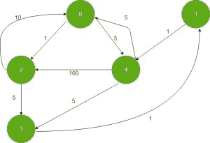

# 源到目的地和返回的最短距离总和至少具有一个公共顶点

> 原文： [https://www.geeksforgeeks.org/sum-of-shortest-distance-on-source-to-destination-and-back-having-at-least-a-common-vertex/](https://www.geeksforgeeks.org/sum-of-shortest-distance-on-source-to-destination-and-back-having-at-least-a-common-vertex/)

给定**有向加权图**和**源**和**目标**顶点。 任务是找到从**源到目标**然后从**目标到源**的路径上最短距离的总和，以使两个路径至少具有一个公共的 **顶点**，而不是源和目标。

***注意**：从目的地到源时，边的所有方向都相反。*

**示例**：

> **输入**：src = 0，des = 1
> 
> **输出**：17
> **说明**：
> 公共顶点为 4，路径为 0-> 4-> 3-> 1-> 4-> 0

**方法**：的想法是使用 [Dijkstra 算法](https://www.geeksforgeeks.org/dijkstras-shortest-path-algorithm-greedy-algo-7/)。 使用 Dijkstra 算法找到从源到目标的最短路径以及从目标到源的最短路径时，除源和目标顶点外，可能不会导致至少有一个公共节点的路径。

*   假设`s`为源顶点，`d`为目标顶点，`v`为从源到目标以及从目标到源的路径中共有的中间节点。 最短的路径对，因此 v 在这两个路径的交点处是路径： **s-> v-> d-> v-> s** 及其长度 是

    > dis [s] [v] + dis [v] [d] + dis [d] [v] + dis [v] [s]

*   由于`s`和`d`是固定的，因此只需找到`v`，使其路径最短即可。

*   为了找到这样的`v`，请执行以下步骤：

    1.  找出所有顶点到`s`和`d`的最短距离，这为我们提供了 **dis [v] [s]** 和 **dis [v] [ d]** 。 要查找从所有顶点到给定节点的最短路径，请参考[从所有顶点到目的地的最短路径](https://www.geeksforgeeks.org/shortest-paths-from-all-vertices-to-a-destination/)。

    2.  从`s`和`d`中找出所有顶点的最短距离，从而得出 **d [s] [v]** 和 **d [d] [v] [** 。

    3.  对所有`v`进行迭代，找到 **d [s] [v] + d [v] [d] + d [d] [v] + d [v] [s]的最小值**。

下面是上述方法的实现：

```

// CPP implementation of the approach 

#include <bits/stdc++.h> 
using namespace std; 
#define INF 0x3f3f3f3f 

// iPair represents the Integer Pair 
typedef pair<int, int> iPair; 

// This class represents 
// a directed graph using 
// adjacency list representation 
class Graph { 

    // Number of vertices 
    int V; 

    // In a weighted graph, store vertex 
    // and weight pair for every edge 
    list<pair<int, int> >* adj; 

public: 
    // Constructor 
    Graph(int V); 

    // Function to add an edge to graph 
    void addEdge(int u, int v, int w); 

    // Find shortest path from 
    // source vertex to all vertex 
    void shortestPath(int src, 
                      vector<int>& dist); 
}; 

// Allocates memory for adjacency list 
Graph::Graph(int V) 
{ 
    this->V = V; 
    adj = new list<iPair>[V]; 
} 

// Function to add an edge to the graph 
void Graph::addEdge(int u, int v, int w) 
{ 
    adj[v].push_back(make_pair(u, w)); 
} 

// Function to find the shortest paths 
// from source to all other vertices 
void Graph::shortestPath(int src, 
                         vector<int>& dist) 
{ 

    // Create a priority queue to 
    // store vertices that 
    // are being preprocessed 
    priority_queue<iPair, 
                   vector<iPair>, 
                   greater<iPair> > 
        pq; 

    // Insert source itself in priority 
    // queue and initialize 
    // its distance as 0 
    pq.push(make_pair(0, src)); 
    dist[src] = 0; 

    // Loop till priority queue 
    // becomes empty (or all 
    // distances are not finalized) 
    while (!pq.empty()) { 

        // The first vertex in pair 
        // is the minimum distance 
        // vertex, extract it from 
        // priority queue 
        int u = pq.top().second; 
        pq.pop(); 

        // 'i' is used to get all 
        // adjacent vertices of a vertex 
        list<pair<int, int> >::iterator i; 
        for (i = adj[u].begin(); i != adj[u].end(); ++i) { 

            // Get vertex label and 
            // weight of current 
            // adjacent of u 
            int v = (*i).first; 
            int weight = (*i).second; 

            // If there is shorted 
            // path to v through u 
            if (dist[v] > dist[u] + weight) { 

                // Updating distance of v 
                dist[v] = dist[u] + weight; 
                pq.push(make_pair(dist[v], v)); 
            } 
        } 
    } 
} 

// Function to return the 
// required minimum path 
int minPath(int V, int src, int des, 
            Graph g, Graph r) 
{ 
    // Create a vector for 
    // distances and 
    // initialize all distances 
    // as infinite (INF) 

    // To store distance of all 
    // vertex from source 
    vector<int> dist(V, INF); 

    // To store distance of all 
    // vertex from destination 
    vector<int> dist2(V, INF); 

    // To store distance of source 
    // from all vertex 
    vector<int> dist3(V, INF); 

    // To store distance of 
    // destination from all vertex 
    vector<int> dist4(V, INF); 

    // Computing shortest path from 
    // source vertex to all vertices 
    g.shortestPath(src, dist); 

    // Computing shortest path from 
    // destination vertex to all vertices 
    g.shortestPath(des, dist2); 

    // Computing shortest path from 
    // all the vertices to source 
    r.shortestPath(src, dist3); 

    // Computing shortest path from 
    // all the vertices to destination 
    r.shortestPath(des, dist4); 

    // Finding the intermediate node (IN) 
    // such that the distance of path 
    // src -> IN -> des -> IN -> src is minimum 

    // To store the shortest distance 
    int ans = INT_MAX; 

    for (int i = 0; i < V; i++) { 

        // Intermediate node should not be 
        // the source and destination 
        if (i != des && i != src) 
            ans = min( 
                ans, 
                dist[i] + dist2[i] 
                    + dist3[i] + dist4[i]); 
    } 

    // Return the minimum path required 
    return ans; 
} 

// Driver code 
int main() 
{ 

    // Create the graph 
    int V = 5; 
    int src = 0, des = 1; 

    // To store the original graph 
    Graph g(V); 

    // To store the reverse graph 
    // and compute distance from all 
    // vertex to a particular vertex 
    Graph r(V); 

    // Adding edges 
    g.addEdge(0, 2, 1); 
    g.addEdge(0, 4, 5); 
    g.addEdge(1, 4, 1); 
    g.addEdge(2, 0, 10); 
    g.addEdge(2, 3, 5); 
    g.addEdge(3, 1, 1); 
    g.addEdge(4, 0, 5); 
    g.addEdge(4, 2, 100); 
    g.addEdge(4, 3, 5); 

    // Adding edges in reverse direction 
    r.addEdge(2, 0, 1); 
    r.addEdge(4, 0, 5); 
    r.addEdge(4, 1, 1); 
    r.addEdge(0, 2, 10); 
    r.addEdge(3, 2, 5); 
    r.addEdge(1, 3, 1); 
    r.addEdge(0, 4, 5); 
    r.addEdge(2, 4, 100); 
    r.addEdge(3, 4, 5); 

    cout << minPath(V, src, des, g, r); 

    return 0; 
} 

```

**Output:**

```
17

```


* * *

* * *

如果您喜欢 GeeksforGeeks 并希望做出贡献，则还可以使用 [tribution.geeksforgeeks.org](https://contribute.geeksforgeeks.org/) 撰写文章，或将您的文章邮寄至 tribution@geeksforgeeks.org。 查看您的文章出现在 GeeksforGeeks 主页上，并帮助其他 Geeks。

如果您发现任何不正确的地方，请单击下面的“改进文章”按钮，以改进本文。