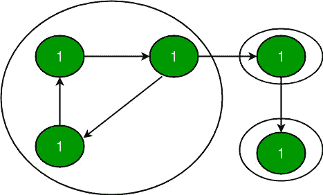
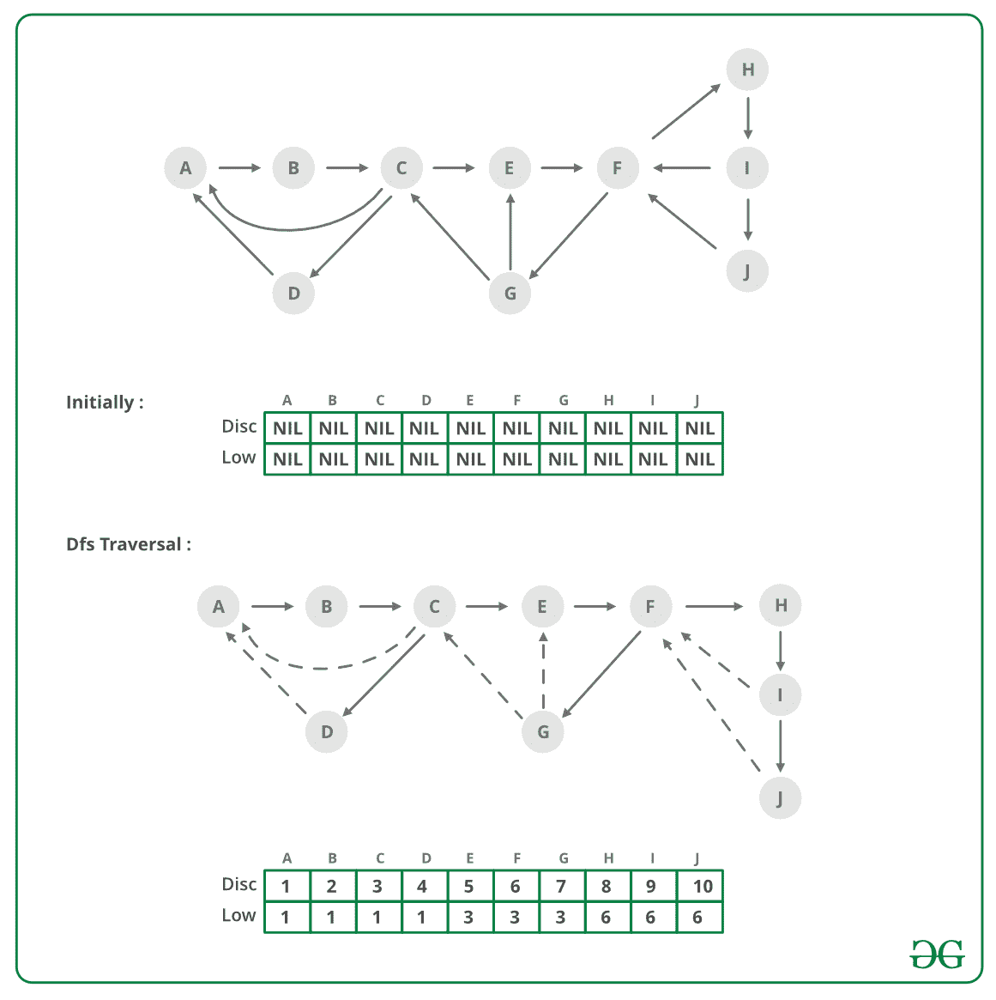
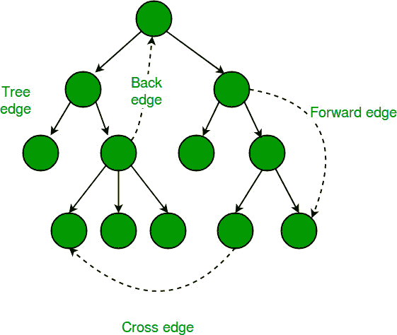

# Tarjan 的算法，用于查找强连接的组件

> 原文： [https://www.geeksforgeeks.org/tarjan-algorithm-find-strongly-connected-components/](https://www.geeksforgeeks.org/tarjan-algorithm-find-strongly-connected-components/)

如果所有对顶点之间都有路径，则有向图是牢固连接的。 有向图的强连接组件（ **SCC** ）是最大的强连接子图。 例如，下图中有 3 个 SCC。

[](https://media.geeksforgeeks.org/wp-content/cdn-uploads/kosaraju.jpg)

我们已经讨论了 [Kosaraju 用于强连接组件](https://www.geeksforgeeks.org/strongly-connected-components/)的算法。 先前讨论的算法需要图的两个 DFS 遍历。 在这篇文章中，讨论了 [Tarjan 的算法](http://en.wikipedia.org/wiki/Tarjan%27s_strongly_connected_components_algorithm)，该算法仅需要遍历一个 DFS。

Tarjan 算法基于以下事实：
1\. DFS 搜索产生 DFS 树/林
2.强连接的组件形成 DFS 树的子树。
3.如果可以找到此类子树的头，则可以打印/存储该子树中的所有节点（包括头），这将是一个 SCC。
4.从一个 SCC 到另一个 SCC 没有后边缘（可以有交叉边缘，但是在处理图形时将不使用交叉边缘）。

为了找到 SCC 的头部，我们计算了椎间盘和低位阵列（如[铰接点](https://www.geeksforgeeks.org/articulation-points-or-cut-vertices-in-a-graph/)，[桥](https://www.geeksforgeeks.org/bridge-in-a-graph/)，[双连接组件](https://www.geeksforgeeks.org/biconnectivity-in-a-graph/)一样）。 如前几篇文章中所述，low [u]表示可以从以 u 为根的子树中找到的最早访问的顶点（发现时间最短的顶点）。 如果 disc [u] = low [u]，则节点 u 为头。

下图说明了该方法：


强连通组件仅与有向图有关，而 Disc 和 Low 值与有向图和无向图都有关，因此在上图中，我们采用了无向图。

在上图中，我们显示了一个图及其 DFS 树之一（同一图上可能有不同的 DFS 树，具体取决于遍历边的顺序）。
在 DFS 树中，连续箭头是树边缘，而虚线箭头是后边缘（ [DFS 树边缘](http://en.wikipedia.org/wiki/Depth-first_search#Output_of_a_depth-first_search)
每个节点的 Disc 和 Low 值在图中显示为（Disc / Low）。 HTG4] **光盘：**这是遍历 DFS 时访问节点 1 <sup>st</sup> 时间的时间，对于 DFS 树中的节点 A，B，C，..，J，光盘值 是 1，2，3，..，10。
**低：**在 DFS 树中，树的边缘将我们从祖先节点转到其后代之一，例如，从节点 C 到树 边沿可以将我们带到节点 G，节点 I 等，后沿可以将我们从后代节点向后移到其祖先之一，例如，从节点 G，后沿可以将我们带到 E 或 C。 将树和后边缘放在一起，那么我们可以看到，如果从一个节点开始遍历，则可以通过树边缘向下穿过树，然后通过后边缘向上穿过，例如，从节点 E 可以向下到 G 和 然后上升到 C。类似地，从 E，我们可以下降到 I 或 J a 然后上升到 F。节点的“低”值通过该节点的子树告诉最高可达到的祖先（具有最小的 Disc 值）。 因此，对于任何节点，“低”值始终等于其“光盘”值（节点是其自身的祖先）。 然后我们查看它的子树，看看是否有任何节点可以将我们带到其任何祖先。 如果子树中有多个后边缘将我们带到不同的祖先，则我们选择具有最小 Disc 值（即最高的一个）的后边缘。 如果我们看节点 F，它有两个子树。 带有节点 G 的子树将我们带到 E 和 C。另一个子树将我们带回到 F。 在这里，最高的祖先是 C，其中 F 可以到达，因此 F 的低值是 3（C 的 Disc 值）。
根据以上讨论，应该清楚 B，C 和 D 的低值为 1（因为 A 是 B，C 和 D 可以到达的最高节点）。 同样，E，F，G 的低值是 3，H，I，J 的低值是 6。

对于任何节点 u，当 DFS 启动时，会将 Low 设置为其 Disc 1 <sup>st</sup> 。
然后稍后将在 DFS 的每个子 v 上逐一执行，u 的低值可以将其更改为两种情况：
**Case1（树边缘）：**如果节点 v 不是 已经访问过，然后在 v 的 DFS 完成之后，low [u]和 low [v]的最小值将更新为 low [u]。
low [u] = min（low [u]，low [v]）;
**情况 2（后边缘）：**当子 v 已被访问时，low [u]和 Disc [v]的最小值将更新为 low [u]。
low [u] = min（low [u]，disc [v]）;
在第二种情况下，我们可以取 low [v]代替 disc [v]吗？ 。 答案是**否**。 如果您认为答案为何为**否**，则您可能已经了解了低和碟片概念。

[](https://media.geeksforgeeks.org/wp-content/cdn-uploads/tarjan.jpg) 
相同的低和圆盘值有助于解决其他图形问题，例如[铰接点](https://www.geeksforgeeks.org/articulation-points-or-cut-vertices-in-a-graph/)，[桥](https://www.geeksforgeeks.org/bridge-in-a-graph/)和[双向连接组件](https://www.geeksforgeeks.org/biconnectivity-in-a-graph/)。

为了跟踪植根于头部的子树，我们可以使用堆栈（在访问时保持推送节点）。 找到头节点后，从堆栈中弹出所有节点，直到您离开堆栈为止。

为确保不出现交叉边缘，当我们到达已访问的节点时，仅当访问的节点存在于堆栈中时才应对其进行处理，否则将忽略该节点。

下面是实现 Tarjan 算法以打印所有 SCC 的方法。

## C / C ++

```

// A C++ program to find strongly connected components in a given 
// directed graph using Tarjan's algorithm (single DFS) 
#include<iostream> 
#include <list> 
#include <stack> 
#define NIL -1 
using namespace std; 

// A class that represents an directed graph 
class Graph 
{ 
    int V;    // No. of vertices 
    list<int> *adj;    // A dynamic array of adjacency lists 

    // A Recursive DFS based function used by SCC() 
    void SCCUtil(int u, int disc[], int low[], 
                 stack<int> *st, bool stackMember[]); 
public: 
    Graph(int V);   // Constructor 
    void addEdge(int v, int w);   // function to add an edge to graph 
    void SCC();    // prints strongly connected components 
}; 

Graph::Graph(int V) 
{ 
    this->V = V; 
    adj = new list<int>[V]; 
} 

void Graph::addEdge(int v, int w) 
{ 
    adj[v].push_back(w); 
} 

// A recursive function that finds and prints strongly connected 
// components using DFS traversal 
// u --> The vertex to be visited next 
// disc[] --> Stores discovery times of visited vertices 
// low[] -- >> earliest visited vertex (the vertex with minimum 
//             discovery time) that can be reached from subtree 
//             rooted with current vertex 
// *st -- >> To store all the connected ancestors (could be part 
//           of SCC) 
// stackMember[] --> bit/index array for faster check whether 
//                  a node is in stack 
void Graph::SCCUtil(int u, int disc[], int low[], stack<int> *st, 
                    bool stackMember[]) 
{ 
    // A static variable is used for simplicity, we can avoid use 
    // of static variable by passing a pointer. 
    static int time = 0; 

    // Initialize discovery time and low value 
    disc[u] = low[u] = ++time; 
    st->push(u); 
    stackMember[u] = true; 

    // Go through all vertices adjacent to this 
    list<int>::iterator i; 
    for (i = adj[u].begin(); i != adj[u].end(); ++i) 
    { 
        int v = *i;  // v is current adjacent of 'u' 

        // If v is not visited yet, then recur for it 
        if (disc[v] == -1) 
        { 
            SCCUtil(v, disc, low, st, stackMember); 

            // Check if the subtree rooted with 'v' has a 
            // connection to one of the ancestors of 'u' 
            // Case 1 (per above discussion on Disc and Low value) 
            low[u]  = min(low[u], low[v]); 
        } 

        // Update low value of 'u' only of 'v' is still in stack 
        // (i.e. it's a back edge, not cross edge). 
        // Case 2 (per above discussion on Disc and Low value) 
        else if (stackMember[v] == true) 
            low[u]  = min(low[u], disc[v]); 
    } 

    // head node found, pop the stack and print an SCC 
    int w = 0;  // To store stack extracted vertices 
    if (low[u] == disc[u]) 
    { 
        while (st->top() != u) 
        { 
            w = (int) st->top(); 
            cout << w << " "; 
            stackMember[w] = false; 
            st->pop(); 
        } 
        w = (int) st->top(); 
        cout << w << "\n"; 
        stackMember[w] = false; 
        st->pop(); 
    } 
} 

// The function to do DFS traversal. It uses SCCUtil() 
void Graph::SCC() 
{ 
    int *disc = new int[V]; 
    int *low = new int[V]; 
    bool *stackMember = new bool[V]; 
    stack<int> *st = new stack<int>(); 

    // Initialize disc and low, and stackMember arrays 
    for (int i = 0; i < V; i++) 
    { 
        disc[i] = NIL; 
        low[i] = NIL; 
        stackMember[i] = false; 
    } 

    // Call the recursive helper function to find strongly 
    // connected components in DFS tree with vertex 'i' 
    for (int i = 0; i < V; i++) 
        if (disc[i] == NIL) 
            SCCUtil(i, disc, low, st, stackMember); 
} 

// Driver program to test above function 
int main() 
{ 
    cout << "\nSCCs in first graph \n"; 
    Graph g1(5); 
    g1.addEdge(1, 0); 
    g1.addEdge(0, 2); 
    g1.addEdge(2, 1); 
    g1.addEdge(0, 3); 
    g1.addEdge(3, 4); 
    g1.SCC(); 

    cout << "\nSCCs in second graph \n"; 
    Graph g2(4); 
    g2.addEdge(0, 1); 
    g2.addEdge(1, 2); 
    g2.addEdge(2, 3); 
    g2.SCC(); 

    cout << "\nSCCs in third graph \n"; 
    Graph g3(7); 
    g3.addEdge(0, 1); 
    g3.addEdge(1, 2); 
    g3.addEdge(2, 0); 
    g3.addEdge(1, 3); 
    g3.addEdge(1, 4); 
    g3.addEdge(1, 6); 
    g3.addEdge(3, 5); 
    g3.addEdge(4, 5); 
    g3.SCC(); 

    cout << "\nSCCs in fourth graph \n"; 
    Graph g4(11); 
    g4.addEdge(0,1);g4.addEdge(0,3); 
    g4.addEdge(1,2);g4.addEdge(1,4); 
    g4.addEdge(2,0);g4.addEdge(2,6); 
    g4.addEdge(3,2); 
    g4.addEdge(4,5);g4.addEdge(4,6); 
    g4.addEdge(5,6);g4.addEdge(5,7);g4.addEdge(5,8);g4.addEdge(5,9); 
    g4.addEdge(6,4); 
    g4.addEdge(7,9); 
    g4.addEdge(8,9); 
    g4.addEdge(9,8); 
    g4.SCC(); 

    cout << "\nSCCs in fifth graph \n"; 
    Graph g5(5); 
    g5.addEdge(0,1); 
    g5.addEdge(1,2); 
    g5.addEdge(2,3); 
    g5.addEdge(2,4); 
    g5.addEdge(3,0); 
    g5.addEdge(4,2); 
    g5.SCC(); 

    return 0; 
} 

```