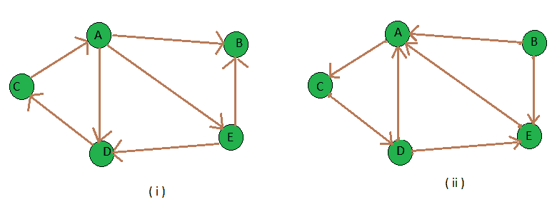

# 转置图

> 原文： [https://www.geeksforgeeks.org/transpose-graph/](https://www.geeksforgeeks.org/transpose-graph/)

[有向图 G 的转置](https://en.wikipedia.org/wiki/transposeGraph)是同​​一组顶点上的另一个有向图，与 G 中相应边的方向相比，所有边都反转了。也就是说，如果 G 包含边（u， v），那么 G 的逆/转置/逆包含边（v，u），反之亦然。

给定[图（表示为邻接表）](https://www.geeksforgeeks.org/graph-and-its-representations/)，我们需要找到另一个图，该图是给定图的转置。

**示例**：



转置图

```
Input : figure (i) is the input graph.
Output : figure (ii) is the transpose graph of the given graph.

```

我们遍历邻接表，并在顶点 u 的邻接表中找到一个顶点 v，该顶点表示主图中从 u 到 v 的边，我们只需在转置图中将 v 到 u 的边添加，即在邻接图中添加 u 新图的顶点 v 的列表。 这样遍历主图所有顶点的列表就可以得到转置图。 因此，该算法的总时间复杂度为 O（V + E），其中 V 是图的顶点数，E 是图的边数。

注意：获取以邻接矩阵格式存储的图的转置很简单，您只需要获取该矩阵的[转置](https://www.geeksforgeeks.org/program-to-find-transpose-of-a-matrix/)。

## C++

```cpp

// CPP program to find transpose of a graph. 
#include <bits/stdc++.h> 
using namespace std; 

// function to add an edge from vertex source to vertex dest 
void addEdge(vector<int> adj[], int src, int dest) 
{ 
    adj[src].push_back(dest);  
} 

// function to print adjacency list of a graph 
void displayGraph(vector<int> adj[], int v) 
{ 
    for (int i = 0; i < v; i++) { 
        cout << i << "--> "; 
        for (int j = 0; j < adj[i].size(); j++) 
            cout << adj[i][j] << "  "; 
        cout << "\n"; 
    } 
} 

// function to get Transpose of a graph taking adjacency 
// list of given graph and that of Transpose graph 
void transposeGraph(vector<int> adj[],  
                     vector<int> transpose[], int v) 
{ 
    // traverse the adjacency list of given graph and 
    // for each edge (u, v) add an edge (v, u) in the 
    // transpose graph's adjacency list 
    for (int i = 0; i < v; i++) 
        for (int j = 0; j < adj[i].size(); j++) 
            addEdge(transpose, adj[i][j], i); 
} 

int main() 
{ 
    int v = 5; 
    vector<int> adj[v]; 
    addEdge(adj, 0, 1); 
    addEdge(adj, 0, 4); 
    addEdge(adj, 0, 3); 
    addEdge(adj, 2, 0); 
    addEdge(adj, 3, 2); 
    addEdge(adj, 4, 1); 
    addEdge(adj, 4, 3); 

    // Finding transpose of graph represented 
    // by adjacency list adj[] 
    vector<int> transpose[v]; 
    transposeGraph(adj, transpose, v); 

    // displaying adjacency list of transpose  
    // graph i.e. b 
    displayGraph(transpose, v); 

    return 0; 
} 

```