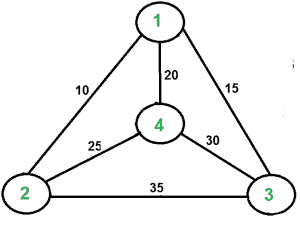

# 旅行商问题（TSP）的实现

> 原文： [https://www.geeksforgeeks.org/traveling-salesman-problem-tsp-implementation/](https://www.geeksforgeeks.org/traveling-salesman-problem-tsp-implementation/)

[旅行推销员问题（TSP）：](https://www.geeksforgeeks.org/travelling-salesman-problem-set-1/)给定一组城市以及每对城市之间的距离，问题在于找到一条最短的路线，该路线可以精确地访问每个城市一次并返回起点。
注意[哈密顿循环](https://www.geeksforgeeks.org/backtracking-set-7-hamiltonian-cycle/)和 TSP 之间的差异。 汉密尔顿周期问题是要找出是否存在一次游览每个城市一次的旅行。 在这里，我们知道存在汉密尔顿巡回赛（因为该图是完整的），实际上，存在许多此类巡回赛，问题在于找到最小权重的汉密尔顿循环。
例如，请考虑右侧图中所示的图表。 图中的 TSP 巡视是 1-2-4-3-1。 这次旅行的费用是 10 + 25 + 30 + 15，即 80。
问题是一个著名的 NP 难题。 没有针对此问题的多项式时间已知解决方案。



**示例**：

```
Output of Given Graph:
minimum weight Hamiltonian Cycle :
10 + 25 + 30 + 15 := 80

```

在本文中，将讨论一个简单解决方案的实现。

1.  将城市 1 作为起点和终点。 由于路线是循环的，因此我们可以将任何点视为起点。
2.  生成所有（n-1）个！ 城市的排列。
3.  计算每个排列的成本，并跟踪最小成本排列。
4.  以最小的成本返回排列。

以下是上述想法的实现

## C++

```cpp

// CPP program to implement traveling salesman
// problem using naive approach.
#include <bits/stdc++.h>
using namespace std;
#define V 4

// implementation of traveling Salesman Problem
int travllingSalesmanProblem(int graph[][V], int s)
{
    // store all vertex apart from source vertex
    vector<int> vertex;
    for (int i = 0; i < V; i++)
        if (i != s)
            vertex.push_back(i);

    // store minimum weight Hamiltonian Cycle.
    int min_path = INT_MAX;
    do {

        // store current Path weight(cost)
        int current_pathweight = 0;

        // compute current path weight
        int k = s;
        for (int i = 0; i < vertex.size(); i++) {
            current_pathweight += graph[k][vertex[i]];
            k = vertex[i];
        }
        current_pathweight += graph[k][s];

        // update minimum
        min_path = min(min_path, current_pathweight);

    } while (
        next_permutation(vertex.begin(), vertex.end()));

    return min_path;
}

// Driver Code
int main()
{
    // matrix representation of graph
    int graph[][V] = { { 0, 10, 15, 20 },
                       { 10, 0, 35, 25 },
                       { 15, 35, 0, 30 },
                       { 20, 25, 30, 0 } };
    int s = 0;
    cout << travllingSalesmanProblem(graph, s) << endl;
    return 0;
}

```

## Java

```java

// Java program to implement 
// traveling salesman problem 
// using naive approach.
import java.util.*;
class GFG{

static int V = 4;

// implementation of traveling 
// Salesman Problem
static int travllingSalesmanProblem(int graph[][],
                                    int s)
{
  // store all vertex apart 
  // from source vertex
  ArrayList<Integer> vertex =
            new ArrayList<Integer>();

  for (int i = 0; i < V; i++)
    if (i != s)
      vertex.add(i);

  // store minimum weight 
  // Hamiltonian Cycle.
  int min_path = Integer.MAX_VALUE;
  do
  {
    // store current Path weight(cost)
    int current_pathweight = 0;

    // compute current path weight
    int k = s;

    for (int i = 0; 
             i < vertex.size(); i++) 
    {
      current_pathweight += 
              graph[k][vertex.get(i)];
      k = vertex.get(i);
    }
    current_pathweight += graph[k][s];

    // update minimum
    min_path = Math.min(min_path, 
                        current_pathweight);

  } while (findNextPermutation(vertex));

  return min_path;
}

// Function to swap the data 
// present in the left and right indices 
public static ArrayList<Integer> swap(
              ArrayList<Integer> data, 
              int left, int right) 
{ 
  // Swap the data 
  int temp = data.get(left); 
  data.set(left, data.get(right)); 
  data.set(right, temp); 

  // Return the updated array 
  return data; 
} 

// Function to reverse the sub-array 
// starting from left to the right 
// both inclusive 
public static ArrayList<Integer> reverse(
              ArrayList<Integer> data, 
              int left, int right) 
{ 
  // Reverse the sub-array 
  while (left < right) 
  { 
    int temp = data.get(left); 
    data.set(left++, 
             data.get(right)); 
    data.set(right--, temp); 
  } 

  // Return the updated array 
  return data; 
} 

// Function to find the next permutation 
// of the given integer array 
public static boolean findNextPermutation(
                      ArrayList<Integer> data) 
{  
  // If the given dataset is empty 
  // or contains only one element 
  // next_permutation is not possible 
  if (data.size() <= 1) 
    return false; 

  int last = data.size() - 2; 

  // find the longest non-increasing 
  // suffix and find the pivot 
  while (last >= 0) 
  { 
    if (data.get(last) < 
        data.get(last + 1)) 
    { 
      break; 
    } 
    last--; 
  } 

  // If there is no increasing pair 
  // there is no higher order permutation 
  if (last < 0) 
    return false; 

  int nextGreater = data.size() - 1; 

  // Find the rightmost successor 
  // to the pivot 
  for (int i = data.size() - 1; 
           i > last; i--) { 
    if (data.get(i) > 
        data.get(last)) 
    { 
      nextGreater = i; 
      break; 
    } 
  } 

  // Swap the successor and 
  // the pivot 
  data = swap(data, 
              nextGreater, last); 

  // Reverse the suffix 
  data = reverse(data, last + 1, 
                 data.size() - 1); 

  // Return true as the 
  // next_permutation is done 
  return true; 
} 

// Driver Code
public static void main(String args[])
{
  // matrix representation of graph
  int graph[][] = {{0, 10, 15, 20},
                   {10, 0, 35, 25},
                   {15, 35, 0, 30},
                   {20, 25, 30, 0}};
  int s = 0;
  System.out.println(
  travllingSalesmanProblem(graph, s));
}
}

// This code is contributed by adityapande88

```

## Python3

```

# Python3 program to implement traveling salesman 
# problem using naive approach. 
from sys import maxsize 
from itertools import permutations
V = 4

# implementation of traveling Salesman Problem 
def travellingSalesmanProblem(graph, s): 

    # store all vertex apart from source vertex 
    vertex = [] 
    for i in range(V): 
        if i != s: 
            vertex.append(i) 

    # store minimum weight Hamiltonian Cycle 
    min_path = maxsize 
    next_permutation=permutations(vertex)
    for i in next_permutation:

        # store current Path weight(cost) 
        current_pathweight = 0

        # compute current path weight 
        k = s 
        for j in i: 
            current_pathweight += graph[k][j] 
            k = j 
        current_pathweight += graph[k][s] 

        # update minimum 
        min_path = min(min_path, current_pathweight) 

    return min_path 

# Driver Code 
if __name__ == "__main__": 

    # matrix representation of graph 
    graph = [[0, 10, 15, 20], [10, 0, 35, 25], 
            [15, 35, 0, 30], [20, 25, 30, 0]] 
    s = 0
    print(travellingSalesmanProblem(graph, s))

```

输出：

```
80

```


* * *

* * *

如果您喜欢 GeeksforGeeks 并希望做出贡献，则还可以使用 [tribution.geeksforgeeks.org](https://contribute.geeksforgeeks.org/) 撰写文章，或将您的文章邮寄至 tribution@geeksforgeeks.org。 查看您的文章出现在 GeeksforGeeks 主页上，并帮助其他 Geeks。

如果您发现任何不正确的地方，请单击下面的“改进文章”按钮，以改进本文。