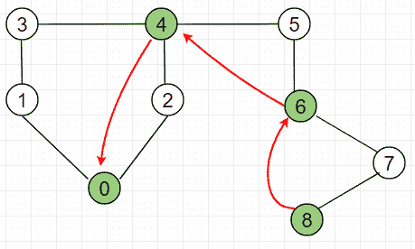
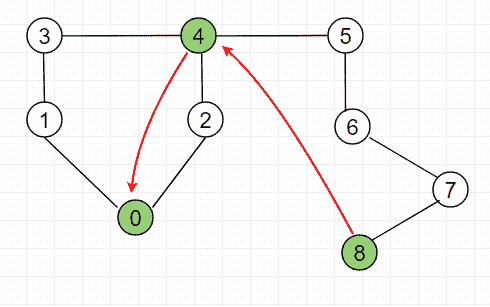
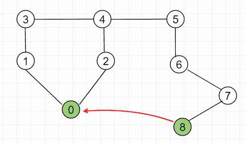

# 联合查找算法| （按等级合并，按优化路径压缩查找）

> 原文： [https://www.geeksforgeeks.org/union-find-algorithm-union-rank-find-optimized-path-compression/](https://www.geeksforgeeks.org/union-find-algorithm-union-rank-find-optimized-path-compression/)

检查给定图是否包含循环。

**示例**：

```
Input: 

Output: Graph contains Cycle.

Input: 

Output: Graph does not contain Cycle.

```

先决条件：[不交集（或并集）](https://www.geeksforgeeks.org/union-find/)，[通过等级和路径压缩的并集](https://www.geeksforgeeks.org/union-find-algorithm-set-2-union-by-rank/)

我们已经讨论了[联合查找循环](https://www.geeksforgeeks.org/union-find/)的方法。 在这里，我们讨论通过路径压缩查找，在这种情况下，它经过稍微修改以比原始方法更快地工作，因为每次上图时我们都跳过一个级别。 查找功能的实现是迭代的，因此不涉及开销。优化查找功能的时间复杂度为 O（log *（n）），即迭代对数，对于重复调用收敛到 O（1）。

请参考此链接以获取
[联合发现](https://en.wikipedia.org/wiki/Proof_of_O(log*n)_time_complexity_of_union%E2%80%93find)
**的 log *（n）复杂度证明。查找功能的解释**：
以示例 1 理解查找功能：

（1）首次为**调用 find（8），映射将如下所示：

进行了 3 个映射，以使用 find 函数获得节点 8 的根。 如下图所示：
从节点 8，跳过节点 7，到达节点 6。
从节点 6，跳过节点 5，到达节点 4。
从节点 4，跳过节点 2，到达节点 0。**

（2）再次调用**的 find（8）**，映射将如下所示：

进行了 2 次映射，以使用 find 函数获得节点 8 的根。 如下所示：
从节点 8，跳过节点 5，节点 6 和节点 7，到达节点 4。
从节点 4，跳过节点 2，到达节点 0。

（3）再次为**调用 find（8）**，映射将如下所示：


最后，我们发现 find 函数仅花费了 1 个映射即可获得节点 8 的根。映射如下所示：
从节点 8，跳过了节点 5，节点 6，节点 7，节点 4，以及节点 2，达到了 节点 0。
这就是它将特定映射到单个映射的路径收敛的方法。

**示例 1 的说明**：

最初，数组大小和 Arr 看起来像：
Arr [9] = {0，1，2，3，4，5，6，7，8}
size [9] = {1，1，1， 1，1，1，1，1，1}

考虑图中的边，并如下将它们逐个添加到不交集集合中：
**边 1：0-1**
find（0）= > 0， find（1）= > 1，两者都有不同的根父级
将它们放在单个连接的组件中，因为当前它们不属于不同的连接组件。
Arr [1] = 0，大小[0] = 2；

**边缘 2：0-2**
find（0）= > 0，find（2）= > 2，两者都有不同的根父级
Arr [2] = 0， size [0] = 3;

**边 3：1-3**
find（1）= > 0，find（3）= > 3，它们都有不同的根父级
Arr [3] = 0， size [0] = 3;

**边缘 4：3-4**
find（3）= > 1，find（4）= > 4，两者都有不同的根父级
Arr [4] = 0， size [0] = 4;

**边缘 5：2-4**
find（2）= > 0，find（4）= > 0，它们都有相同的根父级
因此，存在一个循环 图形。
我们不再进一步检查图中的循环。

## C++

```cpp

// CPP program to implement Union-Find with union 
// by rank and path compression. 
#include <bits/stdc++.h> 
using namespace std; 

const int MAX_VERTEX = 101; 

// Arr to represent parent of index i 
int Arr[MAX_VERTEX]; 

// Size to represent the number of nodes 
// in subgxrph rooted at index i 
int size[MAX_VERTEX]; 

// set parent of every node to itself and 
// size of node to one 
void initialize(int n) 
{ 
    for (int i = 0; i <= n; i++) { 
        Arr[i] = i; 
        size[i] = 1; 
    } 
} 

// Each time we follow a path, find function 
// compresses it further until the path length 
// is greater than or equal to 1\. 
int find(int i) 
{ 
    // while we reach a node whose parent is 
    // equal to itself 
    while (Arr[i] != i) 
    { 
        Arr[i] = Arr[Arr[i]]; // Skip one level 
        i = Arr[i]; // Move to the new level 
    } 
    return i; 
} 

// A function that does union of two nodes x and y 
// where xr is root node  of x and yr is root node of y 
void _union(int xr, int yr) 
{ 
    if (size[xr] < size[yr]) // Make yr parent of xr 
    { 
        Arr[xr] = Arr[yr]; 
        size[yr] += size[xr]; 
    } 
    else // Make xr parent of yr 
    { 
        Arr[yr] = Arr[xr]; 
        size[xr] += size[yr]; 
    } 
} 

// The main function to check whether a given 
// gxrph contains cycle or not 
int isCycle(vector<int> adj[], int V) 
{ 
    // Itexrte through all edges of gxrph, find 
    // nodes connecting them. 
    // If root nodes of both are same, then there is 
    // cycle in gxrph. 
    for (int i = 0; i < V; i++) { 
        for (int j = 0; j < adj[i].size(); j++) { 
            int x = find(i); // find root of i 
            int y = find(adj[i][j]); // find root of adj[i][j] 

            if (x == y) 
                return 1; // If same parent 
            _union(x, y); // Make them connect 
        } 
    } 
    return 0; 
} 

// Driver progxrm to test above functions 
int main() 
{ 
    int V = 3; 

    // Initialize the values for arxry Arr and Size 
    initialize(V); 

    /* Let us create following gxrph 
         0 
        |  \ 
        |    \ 
        1-----2 */

    vector<int> adj[V]; // Adjacency list for gxrph 

    adj[0].push_back(1); 
    adj[0].push_back(2); 
    adj[1].push_back(2); 

    // call is_cycle to check if it contains cycle 
    if (isCycle(adj, V)) 
        cout << "Gxrph contains Cycle.\n"; 
    else
        cout << "Gxrph does not contain Cycle.\n"; 

    return 0; 
} 

```