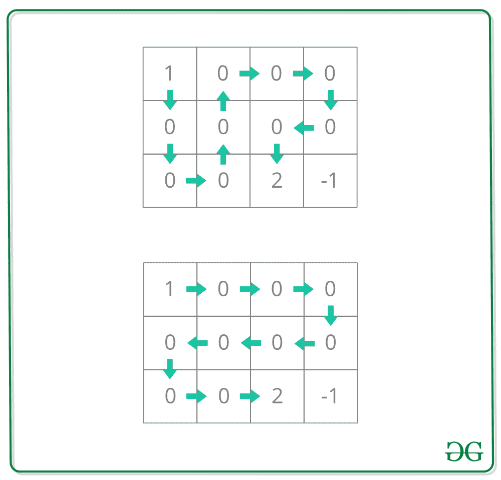

# 在网格中仅覆盖一次所有无障碍块的唯一路径

> 原文： [https://www.geeksforgeeks.org/unique-paths-covering-every-non-obstacle-block-exactly-once-in-a-grid/](https://www.geeksforgeeks.org/unique-paths-covering-every-non-obstacle-block-exactly-once-in-a-grid/)

给定具有`4`类型块的网格 **grid [] []** ：

*  `1`代表起始块。 恰好有一个起点。

*  `2`表示结束块。 恰好有一个结尾块。

*  `0`代表我们可以走过去的空白块。

*  `-1`代表我们无法走过的障碍。

任务是计算从起始块到结束块的路径数，以使每个无障碍块恰好覆盖​​一次。

**示例**：

> **输入**：grid [] [] = {
> {1，0，0，0}，
> {0，0，0，0}，
> {0，0，2 ，-1}}
> **输出**：2
> 以下是涵盖所有非障碍块的唯一路径：
> 
> 
> 
> **输入**：grid [] [] = {
> {1，0，0，0}，
> {0，0，0，0}，
> {0，0，0 ，2}}
> **输出**：4

**方法**：我们可以在此处使用简单的 DFS 进行回溯。 我们可以通过计算途中遇到的所有障碍物并最终将其与可用的障碍物总数进行比较（如果它们匹配），来检查特定路径是否覆盖了所有非障碍障碍物，然后将其添加为有效解决方案。

下面是上述方法的实现：

## C++

```cpp

// C++ implementation of the approach
#include <bits/stdc++.h>
using namespace std;

// Function for dfs.
// i, j ==> Current cell indexes
// vis ==> To mark visited cells
// ans ==> Result
// z ==> Current count 0s visited
// z_count ==> Total 0s present
void dfs(int i, int j, vector<vector<int> >& grid,
         vector<vector<bool> >& vis, int& ans,
         int z, int z_count)
{
    int n = grid.size(), m = grid[0].size();

    // Mark the block as visited
    vis[i][j] = 1;
    if (grid[i][j] == 0)

        // update the count
        z++;

    // If end block reached
    if (grid[i][j] == 2) {

        // If path covered all the non-
        // obstacle blocks
        if (z == z_count)
            ans++;
        vis[i][j] = 0;
        return;
    }

    // Up
    if (i >= 1 && !vis[i - 1][j] && grid[i - 1][j] != -1)
        dfs(i - 1, j, grid, vis, ans, z, z_count);

    // Down
    if (i < n - 1 && !vis[i + 1][j] && grid[i + 1][j] != -1)
        dfs(i + 1, j, grid, vis, ans, z, z_count);

    // Left
    if (j >= 1 && !vis[i][j - 1] && grid[i][j - 1] != -1)
        dfs(i, j - 1, grid, vis, ans, z, z_count);

    // Right
    if (j < m - 1 && !vis[i][j + 1] && grid[i][j + 1] != -1)
        dfs(i, j + 1, grid, vis, ans, z, z_count);

    // Unmark the block (unvisited)
    vis[i][j] = 0;
}

// Function to return the count of the unique paths
int uniquePaths(vector<vector<int> >& grid)
{
    int z_count = 0; // Total 0s present
    int n = grid.size(), m = grid[0].size();
    int ans = 0;
    vector<vector<bool> > vis(n, vector<bool>(m, 0));
    int x, y;
    for (int i = 0; i < n; ++i) {
        for (int j = 0; j < m; ++j) {

            // Count non-obstacle blocks
            if (grid[i][j] == 0)
                z_count++;
            else if (grid[i][j] == 1) {

                // Starting position
                x = i, y = j;
            }
        }
    }
    dfs(x, y, grid, vis, ans, 0, z_count);
    return ans;
}

// Driver code
int main()
{
    vector<vector<int> > grid{ { 1, 0, 0, 0 },
                               { 0, 0, 0, 0 },
                               { 0, 0, 2, -1 } };

    cout << uniquePaths(grid);
    return 0;
}

```

## Python

```py

# Python3 implementation of the approach 

# Function for dfs. 
# i, j ==> Current cell indexes 
# vis ==> To mark visited cells 
# ans ==> Result 
# z ==> Current count 0s visited 
# z_count ==> Total 0s present 
def dfs(i, j, grid, vis, ans, z, z_count):

    n = len(grid)
    m = len(grid[0])

    # Mark the block as visited 
    vis[i][j] = 1

    if (grid[i][j] == 0):

        # Update the count 
        z += 1

    # If end block reached 
    if (grid[i][j] == 2):

        # If path covered all the non- 
        # obstacle blocks 
        if (z == z_count):
            ans += 1

        vis[i][j] = 0

        return grid, vis, ans 

    # Up 
    if (i >= 1 and not vis[i - 1][j] and
                      grid[i - 1][j] != -1): 
        grid, vis, ans = dfs(i - 1, j, grid, 
                             vis, ans, z, 
                             z_count)

    # Down 
    if (i < n - 1 and not vis[i + 1][j] and
                         grid[i + 1][j] != -1): 
        grid, vis, ans = dfs(i + 1, j, grid, 
                             vis, ans, z, 
                             z_count)

    # Left 
    if (j >= 1 and not vis[i][j - 1] and
                      grid[i][j - 1] != -1): 
        grid, vis, ans = dfs(i, j - 1, grid, 
                             vis, ans, z, 
                             z_count) 

    # Right 
    if (j < m - 1 and not vis[i][j + 1] and
                         grid[i][j + 1] != -1): 
        grid, vis, ans = dfs(i, j + 1, grid,
                             vis, ans, z,
                             z_count) 

    # Unmark the block (unvisited) 
    vis[i][j] = 0

    return grid, vis, ans

# Function to return the count 
# of the unique paths 
def uniquePaths(grid): 

    # Total 0s present 
    z_count = 0
    n = len(grid)
    m = len(grid[0])
    ans = 0

    vis = [[0 for j in range(m)]
              for i in range(n)]

    x = 0
    y = 0

    for i in range(n):
        for j in range(m):

            # Count non-obstacle blocks
            if grid[i][j] == 0:
                z_count += 1

            elif (grid[i][j] == 1):

                # Starting position
                x = i
                y = j 

    grid, vis, ans = dfs(x, y, grid, 
                         vis, ans, 0,
                         z_count)

    return ans

# Driver code 
if __name__=='__main__':

    grid = [ [ 1, 0, 0, 0 ], 
             [ 0, 0, 0, 0 ],
             [ 0, 0, 2, -1 ] ]

    print(uniquePaths(grid))

# This code is contributed by rutvik_56

```

**Output:** 

```
2
```


* * *

* * *

如果您喜欢 GeeksforGeeks 并希望做出贡献，则还可以使用 [tribution.geeksforgeeks.org](https://contribute.geeksforgeeks.org/) 撰写文章，或将您的文章邮寄至 tribution@geeksforgeeks.org。 查看您的文章出现在 GeeksforGeeks 主页上，并帮助其他 Geeks。

如果您发现任何不正确的地方，请单击下面的“改进文章”按钮，以改进本文。