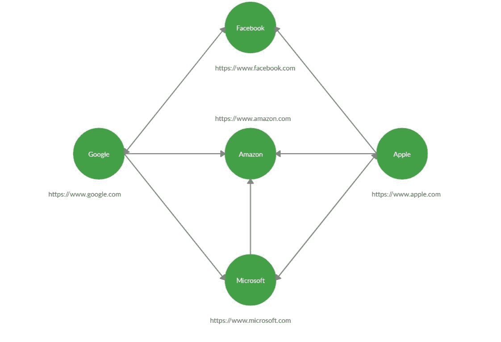

# 什么是网络爬虫，在哪里使用？

> 原文： [https://www.geeksforgeeks.org/what-is-a-webcrawler-and-where-is-it-used/](https://www.geeksforgeeks.org/what-is-a-webcrawler-and-where-is-it-used/)

**Web 爬网程序**是**机器人**，可从互联网下载内容并将其编入索引。 该机器人的主要目的是了解 Internet 上的不同网页。 这种漫游器主要由搜索引擎操作。 通过将[搜索算法](https://www.geeksforgeeks.org/searching-algorithms/)应用于网络爬虫收集的数据，搜索引擎可以提供相关链接，作为对用户请求的请求的响应。 在本文中，我们将讨论如何实现网络搜寻器。

Webcrawler 是[广度优先搜索](https://www.geeksforgeeks.org/breadth-first-search-or-bfs-for-a-graph/)算法的非常重要的应用。 这个想法是整个互联网可以用有向图表示：

*   与顶点->域/ URL /网站。

*   边->连接。

**示例**：



**方法**：该算法的工作原理是解析网站的原始 HTML，并在获取的数据中查找其他 URL。 如果存在 URL，则将其添加到[队列](http://www.geeksforgeeks.org/queue-data-structure/)，并以广度优先搜索的方式访问它们。

> **注意**：由于代理问题，此代码在联机 IDE 上不起作用。 尝试在本地计算机上运行。

```

// Java program to illustrate the WebCrawler 

import java.io.BufferedReader; 
import java.io.InputStreamReader; 
import java.net.URL; 
import java.util.HashSet; 
import java.util.LinkedList; 
import java.util.List; 
import java.util.Queue; 
import java.util.regex.Matcher; 
import java.util.regex.Pattern; 

// Class Contains the functions 
// required for WebCrowler 
class WebCrowler { 

    // To store the URLs in the 
    / /FIFO order required for BFS 
    private Queue<String> queue; 

    // To store visited URls 
    private HashSet<String> 
        discovered_websites; 

    // Constructor for initialzing the 
    // required variables 
    public WebCrowler() 
    { 
        this.queue 
            = new LinkedList<>(); 

        this.discovered_websites 
            = new HashSet<>(); 
    } 

    // Function to start the BFS and 
    // discover all URLs 
    public void discover(String root) 
    { 
        // Storing the root URL to 
        // initiate BFS. 
        this.queue.add(root); 
        this.discovered_websites.add(root); 

        // It will loop until queue is empty 
        while (!queue.isEmpty()) { 

            // To store the URL present in 
            // the front of the queue 
            String v = queue.remove(); 

            // To store the raw HTML of 
            // the website 
            String raw = readUrl(v); 

            // Regular expression for a URL 
            String regex 
                = "https://(\\w+\\.)*(\\w+)"; 

            // To store the pattern of the 
            // URL formed by regex 
            Pattern pattern 
                = Pattern.compile(regex); 

            // To extract all the URL that 
            // matches the pattern in raw 
            Matcher matcher 
                = pattern.matcher(raw); 

            // It will loop until all the URLs 
            // in the current website get stored 
            // in the queue 
            while (matcher.find()) { 

                // To store the next URL in raw 
                String actual = matcher.group(); 

                // It will check whether this URL is 
                // visited or not 
                if (!discovered_websites 
                         .contains(actual)) { 

                    // If not visited it will add 
                    // this URL in queue, print it 
                    // and mark it as visited 
                    discovered_websites 
                        .add(actual); 
                    System.out.println( 
                        "Website found: "
                        + actual); 

                    queue.add(actual); 
                } 
            } 
        } 
    } 

    // Function to return the raw HTML 
    // of the current website 
    public String readUrl(String v) 
    { 

        // Initializing empty string 
        String raw = ""; 

        // Use try-catch block to handle 
        // any exceptions given by this code 
        try { 
            // Convert the string in URL 
            URL url = new URL(v); 

            // Read the HTML from website 
            BufferedReader be 
                = new BufferedReader( 
                    new InputStreamReader( 
                        url.openStream())); 

            // To store the input 
            // from the website 
            String input = ""; 

            // Read the HTML line by line 
            // and append it to raw 
            while ((input 
                    = br.readLine()) 
                   != null) { 
                raw += input; 
            } 

            // Close BufferedReader 
            br.close(); 
        } 

        catch (Exception ex) { 
            ex.printStackTrace(); 
        } 

        return raw; 
    } 
} 

// Driver code 
public class Main { 

    // Driver Code 
    public static void main(String[] args) 
    { 
        // Creating Object of WebCrawler 
        WebCrowler web_crowler 
            = new WebCrowler(); 

        // Given URL 
        String root 
            = "https:// www.google.com"; 

        // Method call 
        web_crowler.discover(root); 
    } 
} 

```

**输出**：

```
Website found: https://www.google.com
Website found: https://www.facebook.com
Website found: https://www.amazon.com
Website found: https://www.microsoft.com
Website found: https://www.apple.com

```

**应用程序**：这种 Web 搜寻器用于获取 Web 的重要参数，例如：

1.  什么是经常访问的网站？

2.  整个网络中哪些重要的网站？

3.  社交网络上的有用信息：Facebook，Twitter 等。

4.  谁是一群人中最受欢迎的人？

5.  谁是公司中最重要的软件工程师？


* * *

* * *

如果您喜欢 GeeksforGeeks 并希望做出贡献，则还可以使用 [tribution.geeksforgeeks.org](https://contribute.geeksforgeeks.org/) 撰写文章，或将您的文章邮寄至 tribution@geeksforgeeks.org。 查看您的文章出现在 GeeksforGeeks 主页上，并帮助其他 Geeks。

如果您发现任何不正确的地方，请单击下面的“改进文章”按钮，以改进本文。