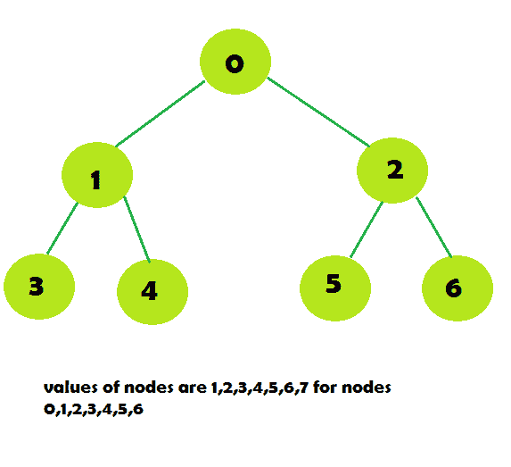

# 给定节点

的子树中所有节点的 XOR

> 原文： [https://www.geeksforgeeks.org/xor-of-all-the-nodes-in-the-sub-tree-of-the-given-node/](https://www.geeksforgeeks.org/xor-of-all-the-nodes-in-the-sub-tree-of-the-given-node/)

给定一个 n 元树和 **Q 个**查询，其中每个查询由表示一个节点的整数`u`组成。 任务是打印给定节点的子树中所有节点值的异或。

**示例**：

> **输入**：
> 
> q [] = {0，1，4，5}
> **输出**：
> 0
> 3
> 5
> 6
> 查询 1：（1 ^ 2 ^ 3 ^ 4 ^ 5 ^ 6 ^ 7）= 0
> 查询 2：（2 ^ 4 ^ 5）= 3
> 查询 3 ：（5）= 5
> 查询 4：（6）= 6

**朴素的方法**：对于每个查询，我们都必须遍历树，以找到子树中所有节点的异或。 因此，代码的复杂度将为 **O（N * Q）**。

**高效方法**：如果我们先遍历整个树，然后首先计算子节点的子树的所有节点的异或，从而预先计算子树的所有节点的异或 然后使用子节点的值来计算父节点的子树的所有节点的异或。 通过这种方式，我们可以计算 **O（N）**时间的异或并将其存储以进行查询。 当询问查询时，我们将在 **O（1）**时间中打印预先计算的值。

下面是上述方法的实现：

## C++

```cpp

// C++ implementation of the approach 
#include <bits/stdc++.h> 
using namespace std; 

// Adjacency list of the graph 
vector<vector<int> > graph; 

// Value of the node 
vector<int> values, xor_values; 

// Function to pre-compute the xor values 
int pre_compute_xor(int i, int prev) 
{ 
    // xor of the sub-tree 
    int x = values[i]; 

    for (int j = 0; j < graph[i].size(); j++) 
        if (graph[i][j] != prev) { 

            // xor x with xor of the sub-tree 
            // of it child nodes 
            x ^= pre_compute_xor(graph[i][j], i); 
        } 

    xor_values[i] = x; 

    // Return the xor 
    return x; 
} 

// Function to return the xor of 
// the nodes of the sub-tree 
// rooted at node u 
int query(int u) 
{ 
    return xor_values[u]; 
} 

// Driver code 
int main() 
{ 
    int n = 7; 

    graph.resize(n); 
    xor_values.resize(n); 

    // Create the graph 
    graph[0].push_back(1); 
    graph[0].push_back(2); 
    graph[1].push_back(3); 
    graph[1].push_back(4); 
    graph[2].push_back(5); 
    graph[2].push_back(6); 

    // Set the values of the nodes 
    values.push_back(1); 
    values.push_back(2); 
    values.push_back(3); 
    values.push_back(4); 
    values.push_back(5); 
    values.push_back(6); 
    values.push_back(7); 

    // Pre-computation 
    pre_compute_xor(0, -1); 

    // Perform queries 
    int queries[] = { 0, 1, 4, 5 }; 
    int q = sizeof(queries) / sizeof(queries[0]); 
    for (int i = 0; i < q; i++) 
        cout << query(queries[i]) << endl; 

    return 0; 
} 

```